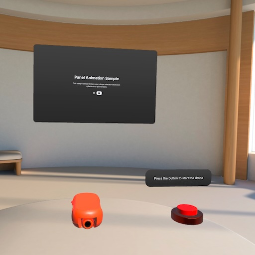

# Animations sample

The Animations sample shows how to play animation clips, create reusable animation drivers, and demonstrates frame-based procedural animation.

## Highlighted features
The Animations sample uses the following Meta Spatial SDK features:
* **[Animations](https://developers.meta.com/horizon/documentation/spatial-sdk/spatial-sdk-animations)**: The sample shows multiple ways to control animations. An example of using the `Animated` class to animate based on glTF file data is in `DroneSceneController`. An example of using the standard Android tool `ValueAnimator` is in `ButtonController`.
* **[glTFs](https://developers.meta.com/horizon/documentation/spatial-sdk/spatial-sdk-gltfs)**: The sample uses glTF models that store animation data about transforms in interpolatable keyframes.
