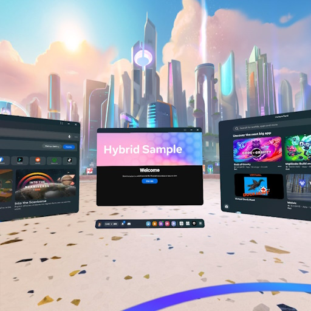
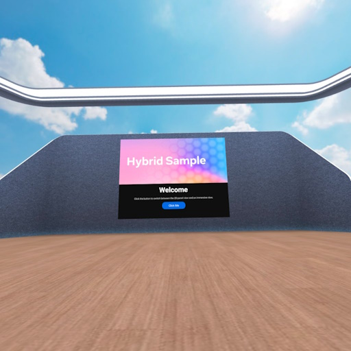

# Hybrid sample

The Hybrid Sample shows how to begin with a standard Android-based 2D panel experience and switch between an immersive experience that hosts the same panel.

## Highlighted feature
The Hybrid sample uses [2D Panels](https://developers.meta.com/horizon/documentation/spatial-sdk/spatial-sdk-2dpanel) to show how to use `PancakeActivity` as a 2D panel in both a panel experience and an immersive experience.
