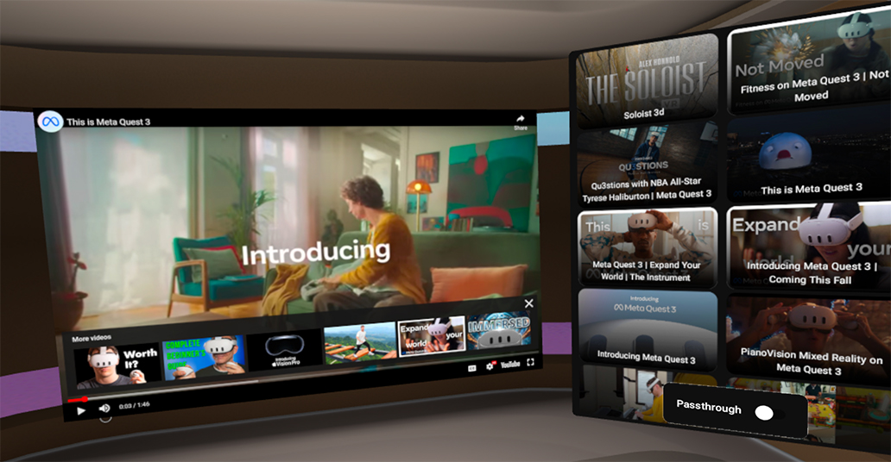

# Media Player sample

The Media Player Sample shows an immersive video playback experience. Users can discover and play videos in a custom environment, editable with the Meta Spatial Editor, or use Passthrough to integrate with the physical environment. It uses a native Android view model to demonstrate communication between a 2D panel listing available videos and the video playback in the immersive environment.

## Highlighted features
The Media Player Sample uses the following Meta Spatial SDK features:
* [2D Panels](https://developers.meta.com/horizon/documentation/spatial-sdk/spatial-sdk-2dpanel):  The sample shows how to use two Jetpack Compose based panels `ListPanel.kt`,`MRPanel.kt` that get displayed in the immersive environment.  Look at the `registerPanels` function in the `MediaPlayerSampleActvity` to see how to spawn the panels.
* [Passthrough](https://developers.meta.com/horizon/documentation/spatial-sdk/spatial-sdk-passthrough/): The sample provides a toggle for the user to enable the visualization of the physical world within the immersive experience.
