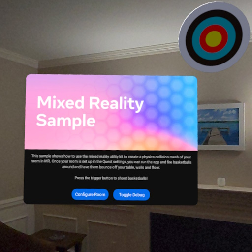

# Mixed Reality sample

The Mixed Reality sample shows how to use Meta Spatial SDK to create an immersive experience that interacts with the user's physical environment. Shoot basketballs at targets on your room's walls, and watch them bounce off walls, ceilings, and objects.

## Highlighted features
The Mixed Reality sample uses these Meta Spatial SDK features:
* **[Mixed Reality Utility Kit](https://developers.meta.com/horizon/documentation/spatial-sdk/spatial-sdk-mruk)**: The sample enables the user to interact with the physical world around them. It shows best practices for requesting permission to access scene mode, retrieving scene data from the device, and creating procedural meshes that align with 2D plane boundaries using `AnchorProceduralMesh`.
* **[Physics](https://developers.meta.com/horizon/documentation/spatial-sdk/spatial-sdk-physics)**:  The sample utilizes the `PhysicsFeature` to enable physical properties like collision detection and gravity.
