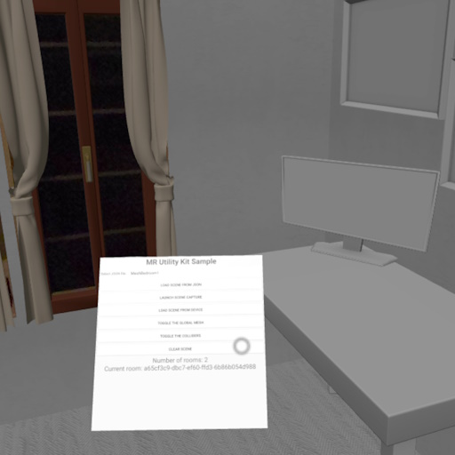

# MRUK sample

The MRUK sample shows how to build an immersive experience influenced by the physical world around the user. It shows how to overlay virtual objects on top physical objects  in the room (tables, couches, windows, doors, beds, and more).

## Highlighted feature
The MRUK Sample uses [Mixed Reality Utility Kit](https://developers.meta.com/horizon/documentation/spatial-sdk/spatial-sdk-mruk) to enable the user to interact with their physical surroundings.  It shows best practices for requesting permission to access scene mode, retrieving scene data from the device, and interacting with the meshes that represent the physical world.
