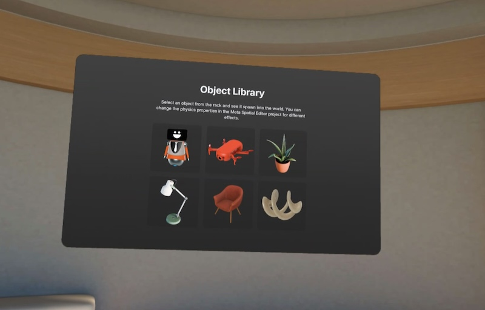

# 3D object sample

The 3D object sample shows how to insert 3D objects into a scene and adjust their properties in [Meta Spatial Editor](https://developers.meta.com/horizon/documentation/spatial-sdk/spatial-editor-overview/).

## Highlighted features
The 3D object sample lets the user select from a set of [3D objects](https://developers.meta.com/horizon/documentation/spatial-sdk/spatial-sdk-3dobjects) and insert them into the [environment](https://developers.meta.com/horizon/documentation/spatial-sdk/spatial-sdk-environment). The 3D objects are [glTFs](https://developers.meta.com/horizon/documentation/spatial-sdk/spatial-sdk-gltfs) that are embedded in the scene's [glXF](https://developers.meta.com/horizon/documentation/spatial-sdk/spatial-sdk-glxf).
