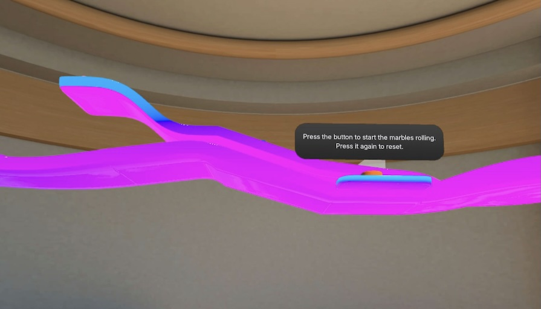

# Physics sample

The physics sample shows how to add the physics component to 3D objects and adjust the component's properties in [Meta Spatial Editor](https://developers.meta.com/horizon/documentation/spatial-sdk/spatial-editor-overview/).

## Highlighted features
The physics sample shows how a set of [3D objects](https://developers.meta.com/horizon/documentation/spatial-sdk/spatial-sdk-3dobjects) can interact with other objects using real-world [physics](https://developers.meta.com/horizon/documentation/spatial-sdk/spatial-sdk-physics) interactions with other objects. The 3D objects are [glTFs](https://developers.meta.com/horizon/documentation/spatial-sdk/spatial-sdk-gltfs) that are embedded in the scene's [glXF](https://developers.meta.com/horizon/documentation/spatial-sdk/spatial-sdk-glxf).

Different interactions (for example, `Button`, `Trigger`, `Spinner`) are implemented as [Systems](https://developers.meta.com/horizon/documentation/spatial-sdk/spatial-sdk-writing-new-system) that are applied to different objects.
