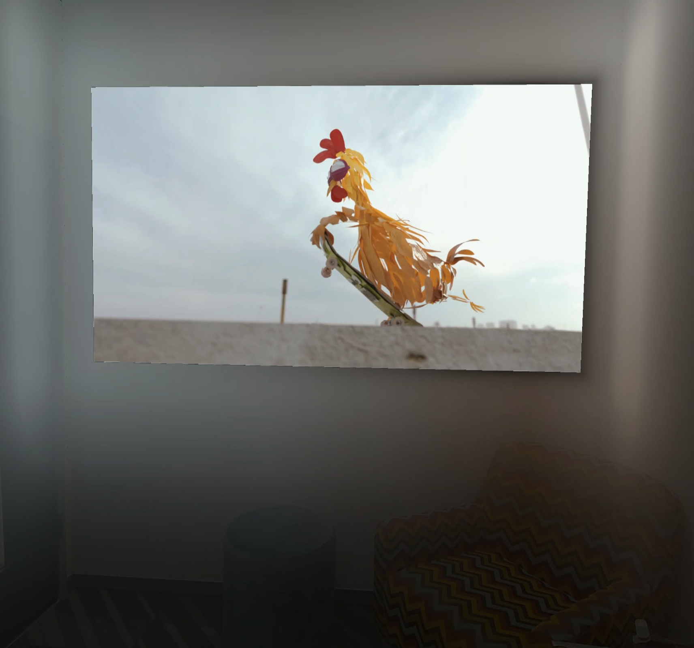

# Premium Media sample

The Premium Media Sample shows an media streaming experience integrated into the users spatial environment. Panels can snap to the walls of the spatial environment and cast reflections using custom shaders. The also shows how to stream 180-degree, stereo, and DRM-protected content.

## Highlighted features
The Premium Media Sample highlights the following Meta Spatial SDK features:
* [MRUK Integration](https://developers.meta.com/horizon/documentation/spatial-sdk/spatial-sdk-mruk): This sample shows how to snap entities to walls in users' Spatial Environment using MRUK.
* [Panel Shaders](https://developers.meta.com/horizon/documentation/spatial-sdk/spatial-sdk-custom-shaders): This sample shows how to use a panel `SceneTexture` to write custom shaders. Panels can cast light onto walls created from MRUK.
* [180 Panels](https://developers.meta.com/horizon/documentation/spatial-sdk/spatial-sdk-2dpanel-registration): This sample shows how to display media onto 180-degree, equirect panels.
* [DRM Protected Streaming](https://developers.meta.com/horizon/documentation/spatial-sdk/spatial-sdk-2dpanel-drm#drm-content): This sample shows how to stream Widevine DRM protected content via Exoplayer and direct-to-surface panels.
* [Direct-To-Surface Panels](https://developers.meta.com/horizon/documentation/spatial-sdk/spatial-sdk-2dpanel-drm#direct-to-surface-rendering): This sample is an example of how to create a more performant panel that an Exoplayer can directly render to. This is required for DRM.
* [Passthrough](https://developers.meta.com/horizon/documentation/spatial-sdk/spatial-sdk-passthrough/): This sample provides a toggle for the user to enable the visualization of the physical world within the immersive experience.
* **Performant Jetpack Compose**: The sample achieves better performance when interacting with Jetpack Compose panels by running the activities on separate processes. This should be done sparingly as activity panels come with additional overhead.
