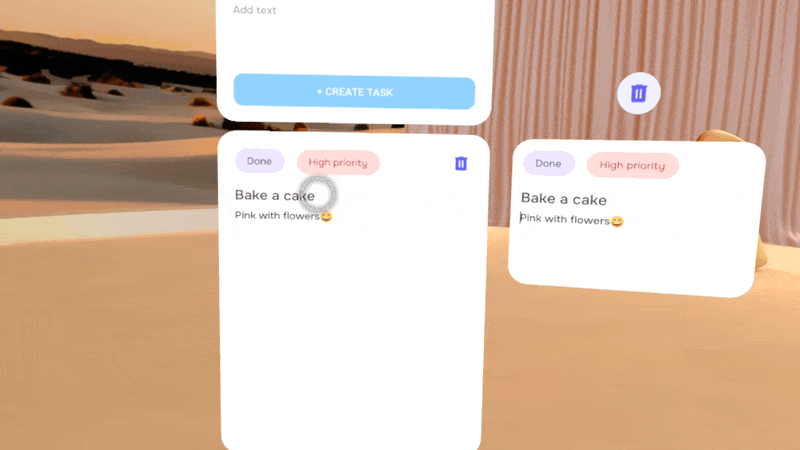
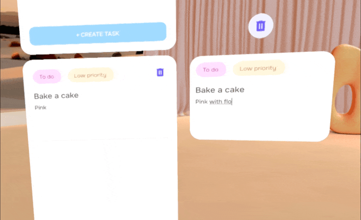

# Store multiple room configurations: Update data and persistence

***Why is this important?***

*In order to maintain application state between sessions, you’ll need to utilize Android Shared Preferences (or equivalent) to save data that can persist after the application has been closed.
Read on to learn more about saving your application data to the Quest headset.*

Focus allows the creation of multiple objects, and each project necessitates storing various data types locally on your device, such as the position and rotation of spatial objects, states, associated text, and other properties.
While Android Shared Preferences can be used for this purpose, SQLite might be a better solution for more complex data structures.

To add a SQLite database in your project you can follow this [Android Developer SQLite Guide](https://developer.android.com/training/data-storage/sqlite)

Focus has implemented a [DatabaseManager](../app/src/main/java/com/meta/focus/DatabaseManager.kt) class to create, save, and retrieve data from a database.

There are five tables with different elements and attributes: *Projects, Unique Assets, Tools, Sticky Notes and Tasks*.
The DatabaseManager implements methods to create, get, update, and delete the elements in these tables.

## Use components to save and retrieve object data and state

In Focus, the elements are split in two categories:
- **Unique Assets:** Elements that are unique in the scene and cannot be deleted, like the Clock, Speaker, Tasks Panel, and AI Exchange Panel.
- **Tools:** Elements the user can create and delete, like Boards, Sticky Notes, Tasks, Labels, Arrows, Shapes, Stickers, and Timers.

All these elements need to be updated in the database any time they change state or position.

The core of Meta Spatial SDK is the **Entity Component System (ECS)**.
To be able to identify different objects in Focus, we created three custom Components to attach to the Entities:
- [UniqueAssetComponent](../app/src/main/java/com/meta/focus/UniqueAssetComponent.kt),
- [ToolComponent](../app/src/main/java/com/meta/focus/ToolComponent.kt) and
- [TimeComponent](../app/src/main/java/com/meta/focus/TimeComponent.kt)

To create a Component you need your class to inherit from *ComponentBase()*.

Here is an example for a custom component:
```kotlin
class UniqueAssetComponent (
    uuid: Int? = 0,
    type: AssetType = AssetType.CLOCK ) : ComponentBase() {

    var uuid by IntAttribute("uuid", R.id.UniqueAssetComponent_uuid, this, uuid)
    var type by EnumAttribute("type", R.id.UniqueAssetComponent_type, this, AssetType::class.java,  type)

    override fun typeID(): Int {
        return UniqueAssetComponent.id
    }
    companion object : ComponentCompanion {
        override val id = R.id.UniqueAssetComponent_class
        override val createDefaultInstance = { UniqueAssetComponent() }
    }
}
```

Don't forget to register your component in your activity to be able to use it:
```kotlin
//ImmersiveActivity.kt
componentManager.registerComponent<UniqueAssetComponent>(UniqueAssetComponent.Companion)
```

For more information on how to create components you can check the *Entity, Components, Attributes, and Systems* section of Spatial SDK documentation.


Each element has not only a unique identifier (uuid), but also different attributes depending on the type of element. For example, the Sticky Note has a text attribute associated, while the Speaker has an On/Off state attribute.

Both, UniqueAsset and Tool components, have a type attribute to identify what kind of asset the entity contains.
This way we are able to identify each spatial object in our scene and update the correct elements and attributes in the database.

Here is just a small part of our *deleteObject()* function, where you can see how we identify the element type to be able to delete the correct object in the database:
```kotlin
val asset = entity.getComponent<ToolComponent>()
when(asset.type) {
    AssetType.STICKY_NOTE -> {
      DB.deleteSticky(asset.uuid)
    }
    else -> {
      DB.deleteToolAsset(asset.uuid)
    }
}
```

## Create a helper system to update objects positions

Focus uses a helper system that updates the position and rotation of objects in a database. It uses Meta Spatial SDK systems and queries to check if an object has been grabbed and updates its position and rotation accordingly.

To create a system you need your class to inherit from *SystemBase()*.
```kotlin
// DatabaseUpdateSystem.kt
class DatabaseUpdateSystem : SystemBase() {
  override fun execute() {
    }
}
```

You also need to register your system in your activity to be able to use it:
```kotlin
// ImmersiveActivity.kt
systemManager.registerSystem(DatabaseUpdateSystem())
```

For more information on how to create systems you can check the *Writing a New System* section of Spatial SDK documentation.

The *execute* function operates every tick, and that's where we will write our code.
Once the app had started, we create a query to pull data from the data model, getting in separate lists all elements that have a UniqueAsset or Tool component.

```kotlin
val tools = Query.where { has(ToolComponent.id) }
val uniqueAssets = Query.where { has(UniqueAssetComponent.id) }
```

We check if any element in the lists has been grabbed, and if so, we update the position and rotation of the element in the database.
This way we are only updating the database when an object changes position, and not every tick for all objects.

```kotlin
val uniqueAssets = Query.where { has(UniqueAssetComponent.id) }
for (entity in uniqueAssets.eval()) {
    val uniqueAsset = entity.getComponent<UniqueAssetComponent>()
    val pose = entity.getComponent<Transform>().transform
    val isGrabbed = entity.getComponent<Grabbable>().isGrabbed

    if (isGrabbed) ImmersiveActivity.instance.get()?.DB?.updateUniqueAsset(uniqueAsset.uuid, pose)
}
```

Consider to run this process every *x* amount of time to improve performance.
Spatial SDK systems and queries are extremely fast and you can probably repeat them in all ticks.
In any case, as good programmers we should try to improve performance any time we can.

In this example, we choose to check if an object has been grabbed every 0.2 seconds, quick enough to allow the user to grab and release an object, and don't miss the interaction.

```kotlin
private var lastTime = System.currentTimeMillis()
override fun execute() {

    val currentTime = System.currentTimeMillis()
    val deltaTime = (currentTime - lastTime) / 1000f
    if (deltaTime > 0.2) {
        lastTime = currentTime

        val uniqueAssets = Query.where { has(UniqueAssetComponent.id) }
        for (entity in uniqueAssets.eval()) {
            val uniqueAsset = entity.getComponent<UniqueAssetComponent>()
            val pose = entity.getComponent<Transform>().transform
            val isGrabbed = entity.getComponent<Grabbable>().isGrabbed

            if (isGrabbed) ImmersiveActivity.instance.get()?.DB?.updateUniqueAsset(uniqueAsset.uuid, pose)
        }
    }
}
```

Check the entire code in [DatabaseUpdateSystem.kt](../app/src/main/java/com/meta/focus/DatabaseUpdateSystem.kt)


## Detection of keyboard events

Now, spatial objects in Focus aren't composed solely of their position and rotation.
They also have different kinds of data associated, as mesh, color, text, state (on/off), and another properties.
Some of them are stored when we create the objects, as we saw earlier.
Others, as text and state, can change during the project, demanding us to detect the best moment to update them on the database.

Focus has several elements with text that need to be saved in the database, as the sticky notes, tasks, web view urls and name of the project itself.
Most texts are just one line, which means the user can press enter in the virtual keyboard and confirm the action when it's done. To be able to detect this, we need to add two properties for the EditTExt in the .XML:
```xml
<EditText
…
android:inputType="text"
android:imeOptions="actionDone" />
```

We also need to set an action listener to the EditText to perform an action once the user finishes writing (when they press enter or close the keyboard).
You can do it this way:
```kotlin
var enterTime:Long = 0
val waitingInterval:Long = (0.5f * 1000).toLong() // 0.5 seconds

editText?.setOnEditorActionListener { v, actionId, event ->
    if (actionId == EditorInfo.IME_ACTION_DONE || event?.action == KeyEvent.ACTION_DOWN && event.keyCode == KeyEvent.KEYCODE_ENTER) {

        // To avoid multiple events to trigger the same action
        if (System.currentTimeMillis() - enterTime >= waitingInterval) {
            enterTime = System.currentTimeMillis()
            onComplete()
            return@setOnEditorActionListener true
        }
    }
    false
}
```


In Focus we also have texts that are not solely one line, as sticky notes or tasks body.
As there is no enter in virtual keyboard for texts with multiple lines, we need to detect when the user stops writing to update.
One good way to do it is to add a TextWatcher to the EditText, to detect when was the last time the user changed the text.

We chose to wait 2 seconds to update the database, once the user stopped writing. You can do it this way:
```kotlin
var lastTextChangeTime:Long = 0
val typingInterval:Long = 1 * 1000
val handler = Handler(Looper.getMainLooper())

editText?.addTextChangedListener(object : TextWatcher {
    override fun beforeTextChanged(s: CharSequence?, start: Int, count: Int, after: Int) { }

    // update lastTime if user is still writing
    override fun onTextChanged(s: CharSequence?, start: Int, before: Int, count: Int) {
        lastTextChangeTime = System.currentTimeMillis()
    }

    override fun afterTextChanged(s: Editable?) {
        handler.postDelayed({
            // Wait to perform action
            if (System.currentTimeMillis() - lastTextChangeTime >= typingInterval) {
                onComplete()
            }
        }, typingInterval)
    }
})
```



We also left you a helper function in [Utils.kt](../app/src/main/java/com/meta/focus/Utils.kt), called *addEditTextListeners()* to be able to add this two methods to any EditText and choose if you want them to be updated when action is done or when the user stops writing.
```kotlin
fun addEditTextListeners(editText: EditText?, onComplete: () -> (Unit), updateWithoutEnter:Boolean = false ) {

    if (!updateWithoutEnter) {
        var enterTime:Long = 0
        val waitingInterval:Long = (0.5f * 1000).toLong() // 0.5 seconds

        editText?.setOnEditorActionListener { v, actionId, event ->
            if (actionId == EditorInfo.IME_ACTION_DONE || event?.action == KeyEvent.ACTION_DOWN && event.keyCode == KeyEvent.KEYCODE_ENTER) {

                // To avoid multiple events to trigger the same action
                if (System.currentTimeMillis() - enterTime >= waitingInterval) {
                    enterTime = System.currentTimeMillis()
                    onComplete()
                    return@setOnEditorActionListener true
                }
            }
            false
        }
    } else {
        var lastTextChangeTime:Long = 0
        val typingInterval:Long = 1 * 1000
        val handler = Handler(Looper.getMainLooper())

        editText?.addTextChangedListener(object : TextWatcher {
            override fun beforeTextChanged(s: CharSequence?, start: Int, count: Int, after: Int) { }

            override fun onTextChanged(s: CharSequence?, start: Int, before: Int, count: Int) {
                lastTextChangeTime = System.currentTimeMillis()
            }

            override fun afterTextChanged(s: Editable?) {
                handler.postDelayed({
                    if (System.currentTimeMillis() - lastTextChangeTime >= typingInterval) {
                        onComplete()
                    }
                }, typingInterval)
            }
        })
    }
}
```
