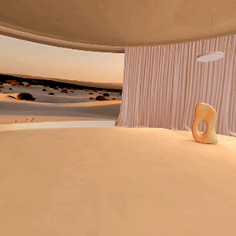
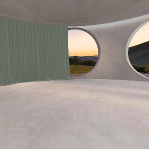
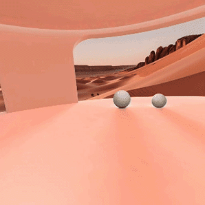

# Create immersive environments

***Why is this important?*** 

*Immersive VR environments transport users to new or distant places. 
The quality of the environment can make or break the immersion and, when done well, can help them focus on the application content more effectively. 
Read on to learn more about creating a high-quality immersive environment in Meta Spatial SDK.*

Focus offers three immersive environments for project development, each consisting of a 3D model, a skybox, and scene lighting. 
These elements function independently but are combined in Focus to form a cohesive concept.

  

## Load and switch between panoramas (skybox)

To create a panorama, or skybox, you can use Spatial SDK skybox Mesh primitive and set a 360 image to the baseTextureAndroidResourceId attribute:
```kotlin
skybox =  Entity.create(
    Mesh(Uri.parse("mesh://skybox")),
    Material().apply {
        baseTextureAndroidResourceId = R.drawable.skybox1
        unlit = true // Prevent scene lighting from affecting the skybox
    },
    Transform(Pose(Vector3(0f)))
)
```

We recommend using a single entity for multiple skyboxes in your scene due to the large size of skybox textures. 
Change the texture of this entity whenever you need to display a different skybox.
```kotlin
skybox.setComponent(
    Material().apply {
        baseTextureAndroidResourceId = R.drawable.skybox2
        unlit = true
    },
)
```

If you need the skyboxes to be shown at the same time, to combine them for example, we recommend you to create a system to load them progressively to improve performance.

## Load and switch between 3D model scenes

3D environments are just like any other custom 3D object of your scene. You can create an entity with a mesh component dynamically from your activity. 
We chose to do it the second way:
```kotlin
environment = Entity.create(
    Mesh(mesh = Uri.parse("environment1.glb")),
    Visible(false),
)
```

Although this ones are like any other 3D object, environments use to be bigger than other models. So, same recommendation as with skyboxes:if you will use more than one, you can change its mesh model instead of creating a different entity.
```kotlin
environment.setComponent(Mesh(mesh = Uri.parse("environment2.glb")))
```

## Change the lighting environment accordingly

With Spatial SDK, you have two ways to set the lighting of your scene.

The first option is to use a .env file. You would probably want to use your skybox texture to generate this file. 
This way the lighting will match with your skybox colors and properties.
```kotlin
scene.updateIBLEnvironment("skybox.env")
```

The other way is to set an ambience and directional light with vectors:
```kotlin
scene.setLightingEnvironment(
    Vector3(2.5f, 2.5f, 2.5f), // ambient light color (none in this case)
    Vector3(1.8f, 1.8f, 1.8f), // directional light color
    -Vector3(1.0f, 3.0f, 2.0f), // directional light direction
)
```

Focus has three different environments and we set a different light configuration for each one, including the introduction lighting:
```kotlin
private fun setLighting(env: Int) {
    when (env) {
        -1 -> {
            scene.setLightingEnvironment(
                Vector3(2.5f, 2.5f, 2.5f), // ambient light color (none in this case)
                Vector3(1.8f, 1.8f, 1.8f), // directional light color
                -Vector3(1.0f, 3.0f, 2.0f), // directional light direction
            )
        }
        0 -> {
            scene.setLightingEnvironment(
                Vector3(1.8f, 1.5f, 1.5f),
                Vector3(1.5f, 1.5f, 1.5f),
                -Vector3(1.0f, 3.0f, 2.0f),
            )
        }
        1 -> {
            scene.setLightingEnvironment(
                Vector3(1.5f, 1.5f, 1.5f),
                Vector3(1.5f, 1.5f, 1.5f),
                -Vector3(1.0f, 3.0f, 2.0f),
            )
        }
        2 -> {
            scene.setLightingEnvironment(
                Vector3(3.5f, 3.5f, 3.5f),
                Vector3(2f, 2f, 2f),
                -Vector3(1.0f, 3.0f, 2.0f),
            )
        }
    }
}
```