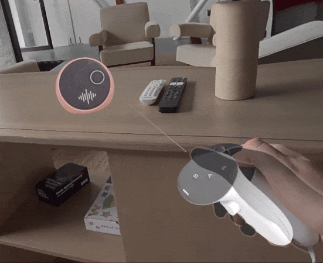
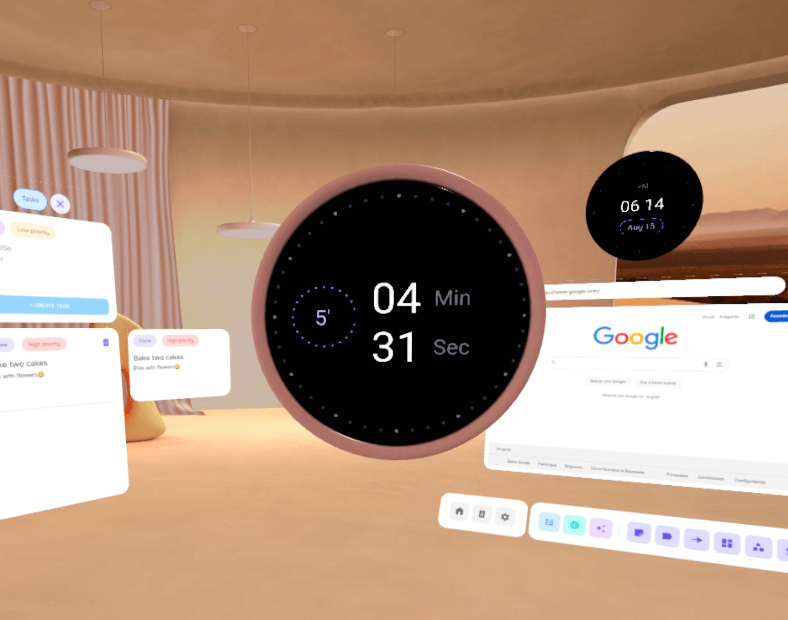

# Creating spatial objects: object hierarchy

***Why is this important?*** 

*For many objects you’ll want to create in your applications, you’ll need to combine multiple entities using object parenting. 
Read on to learn more about creating complex objects with multiple entities.*

## Composed objects

Meta Spatial SDK's core utilizes the Entity Component System (ECS), enabling developers to create spatial objects with **Entities**. 
These **Entities**, essentially blank slates, can be outfitted with components like a Transform or a Mesh to grant it desired properties or behaviors. 
For detailed information, refer to Meta Spatial SDK's Entities documentation.

While each entity can hold various components, only one of each type is allowed. 
Objects such as clocks, speakers, and timers in Focus are built from multiple entities. 
The speaker, for example, is simpler and consists of two entities. 
The first entity incorporates the speaker.glb 3D model, while the second displays an image indicating the ON and OFF states.



Clock and timers are also composed by two entities, first one with a **Mesh component** (*clock.glb* and *timer.glb*), and a second one with a Panel component linked to a specific layout for each element.

Sample code to create an entity with a Mesh component:
```kotlin
// Timer.kt
val timerObj = Entity.create(
    Mesh(mesh = Uri.parse("timer.glb")),
    Scale(0.1f),
    Grabbable(true, GrabbableType.PIVOT_Y),
    Transform(Pose(Vector3(0f)))
)
```

Sample code to create an entity with a Panel component:
```kotlin
// Timer.kt

var id = getDisposableID()
val _width = 0.18f
val _height = 0.18f
val _dp = 1150f

ImmersiveActivity.instance.get()?.registerPanel(
    PanelRegistration(id) {
        layoutResourceId = R.layout.timer_layout
        config {
            themeResourceId = R.style.Theme_Focus_Transparent
            width = _width
            height = _height
            layoutWidthInDp = _dp
            layoutHeightInDp = _dp * (height / width)
            includeGlass = false
        }
        panel {
            rootView?.findViewById<TextView>(R.id.totalTime)?.text = totalTime.toString() + "'"
        }
    }
)

val timerPanel: Entity = Entity.create(
    Panel(id).apply { hittable = MeshCollision.NoCollision },
    Transform(Pose(Vector3(0f, 0f, 0.025f), Quaternion(0f,180f,0f)))
)
```

To link this objects, we need to set one as the parent of the other:
```kotlin
timerPanel.setComponent(TransformParent(timerObj))
```



For **composed objects**, it's best to attach the Grabbable component solely to the parent to ensure the objects remain unified during movement. 
Additionally, consider deactivating the hittable property on child objects. 
This prevents them from obstructing the raycast when interacting with the parent object, especially if it's positioned behind a child.
```kotlin
// Disabling hittable for Mesh component 
Mesh(Uri.parse("mesh://box")).apply { hittable = MeshCollision.NoCollision }

// Disabling hittable for Panel component 
Panel(id).apply { hittable = MeshCollision.NoCollision }
```

**Note**: The Transform of an object that has a TransformParent is relative to the parent.
If you need the global (ie non-relative) transform of an entity, you can use Meta Spatial SDK's function *getAbsoluteTransform()*.


## Spatial audio

**Spatial Audio**, a standout feature in Meta Spatial SDK, allows you to reproduce audio from a specific point in space, giving the impression that the sound is emanating from a particular direction.

To play spatial sound as a child of an entity, you can do it this way:
```kotlin
val timerSound = SceneAudioAsset.loadLocalFile("audio/timer.wav")
scene.playSound(timerSound, entity, 1f)
```

**Note**: Not all audio files can be spatialized. Check Audio specifications in Spatial SDK documentation

## Custom helper functions

In Focus project we built several useful **custom helper functions** to save time for developers when performing repetitive and common actions for spatial apps. 
You can find most of these functions in the script file [Utils.kt](../app/src/main/java/com/meta/focus/Utils.kt).

One of this functions is the *getChildren()*, which returns a list of entities that are children of an entity:
```kotlin
fun getChildren(parent: Entity): MutableList<Entity> {
    var children: MutableList<Entity> = mutableListOf()
        val allChildren = Query.where { has(TransformParent.id) }
        for (child in allChildren.eval()) {
            val _parent = child.getComponent<TransformParent>().entity
            if (parent == _parent) {
                children.add(child)
            }
        }
        return children
    }
}
```

## Deletion of composed objects

To delete entities with Spatial SDK, we can use the following method:
```kotlin
entity.destroy()
```

Nevertheless, deleting an entity that has child objects will lead to an app crash. So, to remove composed objects we need to do a recursive deletion of objects. 
We can use our function *getChildren()* for that.

```kotlin
if (asset.type == AssetType.TIMER) {
    var children = getChildren(entity)
    for (i in children.count() -1 downTo 0) {
      children[i].destroy()
    }
}
entity.destroy();
```

**Note**: this example is just one level of depth recursivity. In case of more complex objects, the functions should also delete the children of the children.
