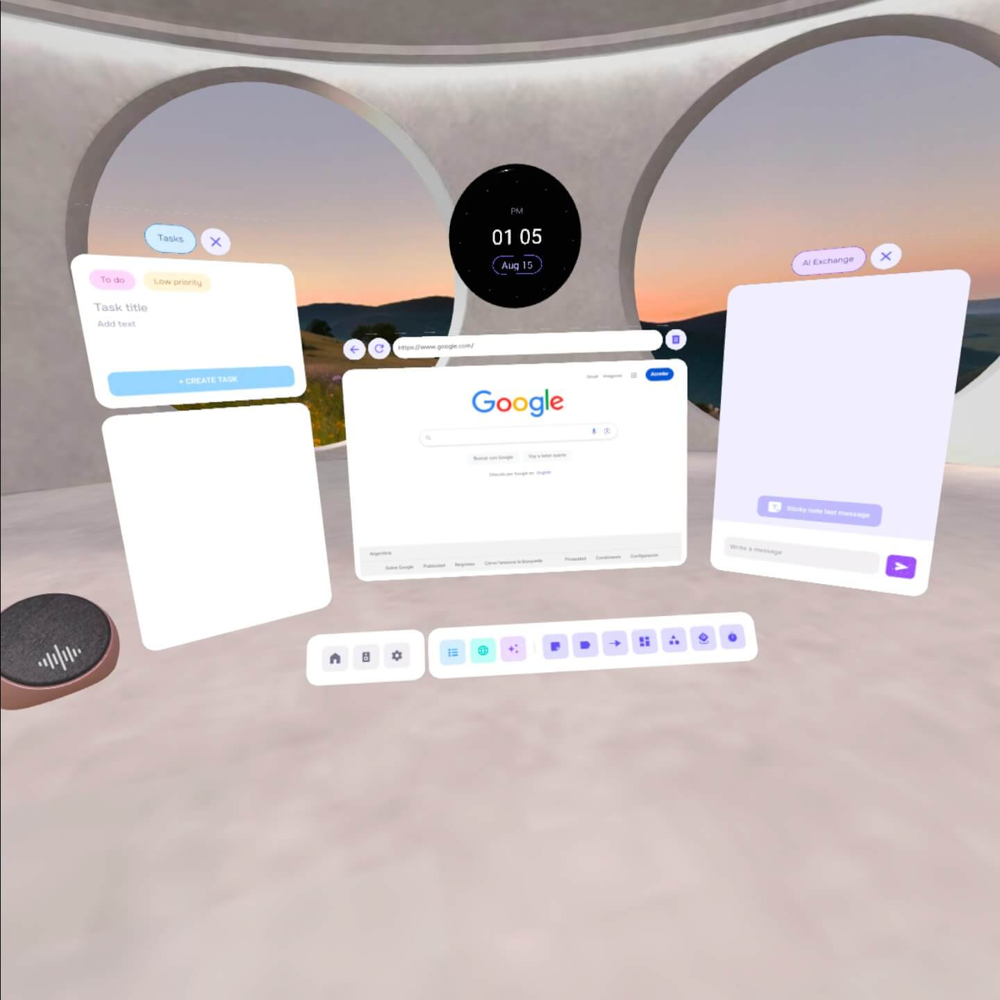

# Spawn objects relative to user’s position

***Why is this important?***

*When spawning new objects in space, it’s important to ensure that this object spawns within the field of view of the user, so that the user is aware that the object was created.
Read on to learn more about spawning objects within the user’s field of view.*

Unlike 2D apps, the space to show elements in spatial apps is unlimited.
That's why it is important to know where is the user standing and which direction is they looking at.
Imagine you need to show an element to the user, but you instantiate it in the original position where the app started?
If the user was moving around, they will probably miss this element.
We need to find a way to make things happen in front of the user.

One of the main Focus mechanics is the creation of tools, elements the user can place around the space.
To instantiate this elements, we created a function that takes the user position and rotation to place an object in front of them.

You can find the *placeInFront()* function in [Utils.kt](../app/src/main/java/com/meta/theelectricfactory/focus/utils/Utils.kt)

We first need to get the user's position. A local entity with an AvatarBody component gives you access to the head:
```kotlin
fun getHeadPose(): Pose {
    val head =
        Query.where { has(AvatarAttachment.id) }
            .eval()
            .filter { it.isLocal() && it.getComponent<AvatarAttachment>().type == "head" }
            .first()
    return head.getComponent<Transform>().transform
}
```

Once we know the user position and rotation, we need to determine the distance from the user we want the object to be shown. We can calculate the new position using Vector3.Forward:
```kotlin
var newPos = headPose.t + headPose.q * Vector3.Forward * distanceFromUser
```

In most cases, you will want to place spatial objects at users head height.
So, to prevent an object to be placed in the ceiling if the user was looking up in the moment the object was instantiated, you should modify the new position height to match user's head one:
```kotlin
newPos.y = headPose.t.y
```

Finally, we will probably want the spatial object to be placed facing the user, and not rotated in other direction.
We can calculate the lookRotation from the user's head to the object new position for that, and rotate it 180 degrees in the Y axis:
```kotlin
var newRot = Quaternion.lookRotation(newPos - headPose.t)
val billboardOrientationEuler: Vector3 =
  entity.tryGetComponent<IsdkGrabbable>()?.billboardOrientation ?: Vector3(0f, 0f, 0f)

newRot *= Quaternion(
  billboardOrientationEuler.x,
  billboardOrientationEuler.y,
  billboardOrientationEuler.z)
```

You can check *placeInFront()* full function below.
It also includes an offset vector in case you need to place an element in a particular pose (relative to user).
You will see that we treat some elements differently, like the toolbar and big panels, that are shown deeper or lower than the rest of the objects.
```kotlin
fun placeInFront(entity: Entity?, offset: Vector3 = Vector3(0f), bigPanel:Boolean = false) {
    val headPose:Pose = getHeadPose()

    val isToolbar = entity!! == ImmersiveActivity.instance.get()?.toolbarPanel

    // We treat toolbar and big panels differently from other objects.
    val height: Float = if (isToolbar) 0.35f else 0.1f
    var distanceFromUser: Float = if (bigPanel) 0.9f else 0.7f

    // Having the users position, we place the entity in front of it, at a particular distance and height
    var newPos = headPose.t + headPose.q * Vector3.Forward * distanceFromUser
    newPos.y = headPose.t.y -height

    // If there is an offset vector, we place the object at the vector position (using user's position as reference)
    if (offset != Vector3(0f)) {
        newPos = headPose.t +
                headPose.q * Vector3.Right * offset.x +
                headPose.q * Vector3.Forward * offset.z

        newPos.y = headPose.t.y + offset.y
    }

    // Add rotation to look in same vector direction as user
    var newRot = Quaternion.lookRotation(newPos - headPose.t)
    val billboardOrientationEuler: Vector3 =
      entity.tryGetComponent<IsdkGrabbable>()?.billboardOrientation ?: Vector3(0f, 0f, 0f)

    newRot *= Quaternion(
      billboardOrientationEuler.x,
      billboardOrientationEuler.y,
      billboardOrientationEuler.z)

    entity.setComponent(Transform(Pose(newPos, newRot)))
}
```


Here is the piece of the code where the main elements are placed at an initial configuration, when a new project has been created:
```kotlin
// ProjectManager.kt
// Initial configuration of panels for a new project
placeInFront(PanelManager.instance.toolbarPanel)
placeInFront(PanelManager.instance.tasksPanel, Vector3(-0.45f, -0.04f, 0.8f))
placeInFront(PanelManager.instance.aiExchangePanel, Vector3(0.45f, -0.05f, 0.8f))
placeInFront(immA?.clock, Vector3(0f, 0.23f, 0.9f))
placeInFront(immA?.speaker, Vector3(-0.65f, -0.3f, 0.65f))
```


