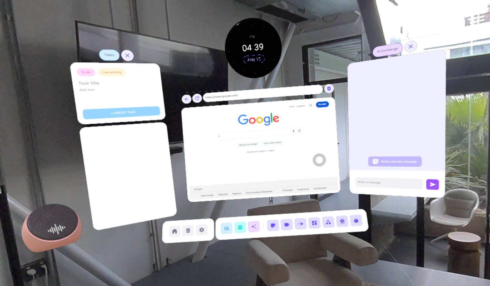
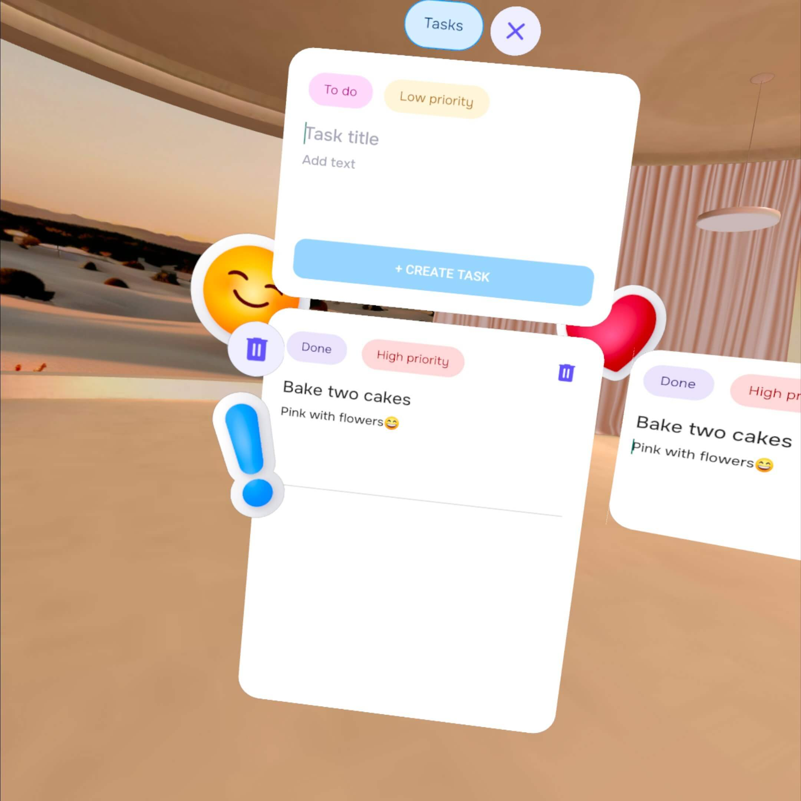

# Panels and interaction with spatial objects

Focus features twelve main panels, including the Home Panel, the Toolbar, and its sub-panels.
But users are also creating panels when they generate Sticky Notes, Timers, WebViews or Spatial Tasks.



## Creating a panel depending on the type

There are several ways to create Panels in Spatial SDK. Your decision will probably depend on the panel functionality. You´d better check Spatial SDK *Runtime Limitations* documentation to know how many panels of a specific type you can create.

The main thing for an Android Developer to understand is that spatial panels are basically views in the space. In order to build one, you will need to create an entity with a Panel component and link it to your view to be able to see it in space.

First of all, you will need to register the panels in your scene by overriding the function registerPanels() in your immersive activity:
```kotlin
// ImmersiveActivity.kt
override fun registerPanels(): List<PanelRegistration> {
    return listOf(
        registerHomePanel(),
        registerToolbarPanel(),
        registerTasksPanel(),
        registerAIExchangePanel(),

        registerStickySubPanel(),
        registerLabelSubPanel(),
        registerArrowSubPanel(),
        registerBoardSubPanel(),
        registerShapesSubPanel(),
        registerStickerSubPanel(),
        registerTimerSubPanel()
    )
}
```

Register your panels by setting the appropriate configuration, including size and other properties:
```kotlin
private fun registerStickySubPanel(): PanelRegistration {

    val panelRegistration = PanelRegistration(R.layout.sticky_sub_panel) {
        config {
            themeResourceId = R.style.Theme_Focus_Transparent
            width = 0.5f
            height = 0.5f
            includeGlass = false
        }
    }

    return panelRegistration
}
```

You'll have at least one activity in your project. If you want to convert it directly into a panel in space, you can check our Home Panel, that is basically our main 2D activity.
In the panel registration, you will have to indicate the activity you want to convert in the attribute *activityClass*.
```kotlin
// ImmersiveActivity.kt
private fun registerHomePanel(): PanelRegistration {

    val panelRegistration = PanelRegistration( R.layout.activity_main) {
        config {
            themeResourceId = R.style.Theme_Focus_Transparent
            width = 0.5f
            height = 0.5f
        }

        activityClass = MainActivity::class.java
    }

    return panelRegistration
}
```

After registering your panels, you need to create entities with panel components and link them with the panels. You can use the R.layout as the panel id.
You can also add a Grabbable component to your entity if you want this spatial panel to be grabbable by the user.
```kotlin
private fun createHomePanel() {
    homePanel = Entity.createPanelEntity(
        R.layout.activity_main,
        Transform(Pose(Vector3(0f))),
        Grabbable(true, GrabbableType.FACE),
        Visible(false)
    )
}
```

In case you want to create a panel dynamically, you can also register it just after creating the panel entity.
Remember to set the same id in the registration and creation of the entity.
You will also need to indicate the layout resource you will use.
```kotlin
// StickyNote.kt
var id = getDisposableID()

ImmersiveActivity.instance.get()?.registerPanel(
    PanelRegistration(id) {
        layoutResourceId = R.layout.sticky_layout
        config {
            themeResourceId = R.style.Theme_Focus_Transparent
            width = 0.5f
            height = 0.5f
        }
    }
)

// Create a grabbable entity with a Panel
val sticky: Entity = Entity.createPanelEntity(
    id,
    Transform(pose),
    Grabbable(true, GrabbableType.PIVOT_Y)
)
```

## Access panels and give them functionality

If you are an Android Developer, you already know that you can give functionality to a button of a view in your activity or fragment this way:
```kotlin
//FirstFragment.kt
override fun onViewCreated(view: View, savedInstanceState: Bundle?) {
super.onViewCreated(view, savedInstanceState)

    binding.buttonNewProject.setOnClickListener {
        ImmersiveActivity.instance.get()?.newProject()
        findNavController().navigate(R.id.action_FirstFragment_to_SecondFragment)
    }
}
```

Now, if you are creating a panel without an activity, you can add functionality to the panel elements when you are registering it, with the *panel* function:
```kotlin
private fun registerStickySubPanel(): PanelRegistration {

    val panelRegistration = PanelRegistration(R.layout.sticky_sub_panel) {
        config {
            themeResourceId = R.style.Theme_Focus_Transparent
            width = 0.5f
            height = 0.5f
        }
        panel {
            for (i in 0..stickyButtons.count()-1) {
                val buttonSticky : ImageButton? = rootView?.findViewById<ImageButton>(stickyButtons[i])
                buttonSticky?.setOnClickListener {
                    // Create sticky note
                    StickyNote(scene = scene, ctx = spatialContext, message = "", color = StickyColor.entries[i])
                    closeSubPanels()
                }
            }
        }
    }
    return panelRegistration
}
```

If you need to modify a panel that has been previously created, the best way is to save a reference of the entity linked to the panel, and get the PanelSceneObject this way:
```kotlin
lateinit var panel: PanelSceneObject
systemManager.findSystem<SceneObjectSystem>().getSceneObject(entity)?.thenAccept {
    sceneObject -> panel = sceneObject as PanelSceneObject
}
val buttonHome : ImageButton? = panel.rootView?.findViewById(R.id.buttonHome)
```

## Panels transparency and spatial text

To use spatial text effectively, create a panel with a transparent background by designing a new theme style and setting the *windowBackground* property to transparent.
```xml
//themes.xml
<style name="Theme.Focus.Transparent" parent="Base.Theme.Focus">
…
  <item name="android:windowBackground">@android:color/transparent</item>
…
 </style>
```

Then you have to apply the theme to the panel configuration. You will probably want to set the *includeGlass* attribute to false in the PanelConfigOptions if you don't want the panel to be seen.
```kotlin
val panelRegistration = PanelRegistration( R.layout.activity_main) {
    config {
        themeResourceId = R.style.Theme_Focus_Transparent
        width = 0.5f
        height = 0.5f
        includeGlass = false
    }
    activityClass = MainActivity::class.java
}
```



If you want to attach a spatial text to an object, you can check our explanation of Composed Objects in [**Creating spatial objects: object hierarchy**](../Documentation/ObjectHierarchy.md).
