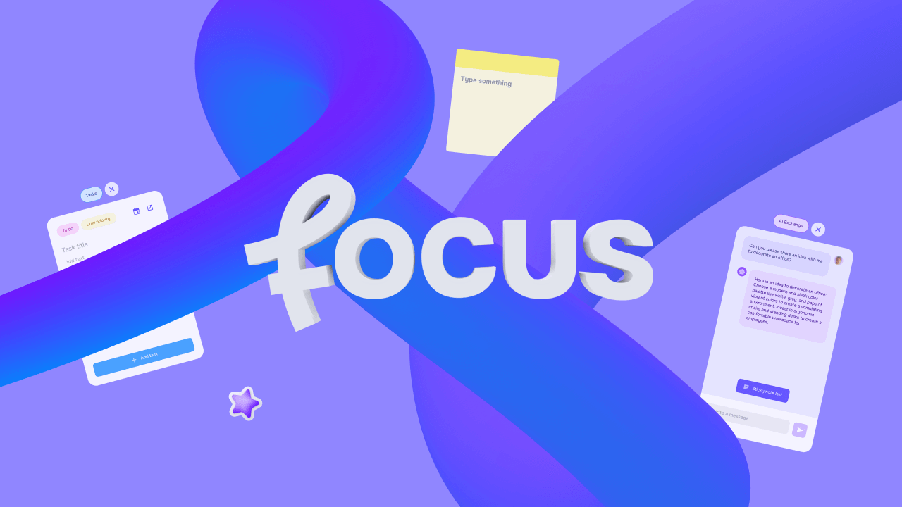

# Focus



Focus is a virtual and mixed reality Quest application that shows developers how to build a productivity app using Meta Spatial SDK. 

Using Quest to extend spatial screens is one of the primary use cases in mixed reality, but there are infinite opportunities to create additional functionality with virtual objects and AI that make using Quest a compelling tool for work. 

In order to build these applications, it is critical to be able to create spatial objects effectively, use persistence to store various layouts, spawn objects in coherent locations, and allow a user to intuitively interact with panels. 

Focus app demonstrates panel and object management, enabling the creation, reuse, and destruction of interactive elements within varied environments.

Focus serves as a practical template for developers looking to create similar applications or integrate these features into their own XR projects.  


## How to run the app in Android Studio

Ensure you have Git LFS installed before cloning this repository. To install Git LFS run this command:
```sh
git lfs install
```

Download [Android Studio](https://developer.android.com/studio) and open the cloned repository using it.

### Meta Spatial SDK version

Check that you are using the latest version of Meta Spatial SDK AARs. AAR files are included in the libs folder, beneath app in the Project view: *YourProject > app > libs*.

You can check Spatial SDK version between the Gradle dependencies as well, in *build.gradle.kts*.


### Deploy to your headset

When you plug in your Meta Quest headset, Android Studio recognizes it as an Android device. Once you have connected your Meta Quest device, click the green Run button in Android Studio to build and deploy your code to your headset.

Put on your headset to see your app running!


## Mechanics and Features (for end users)

From an end user point of view, Focus includes the following elements: 

**Home Panel**: where users can create a new project or open previous ones.

**Settings Panel**: configuration of the project (name, 3D environment selection or passthrough mode).

**Task Panel**: allow users to create tasks with a title, body and select between different priority states. E.g.: *To do*, *High priority*.

**AI Exchange Panel**: allows the user to chat with a virtual assistant, an artificial intelligence with whom to exchange ideas. Users can also create sticky notes with the answers of the virtual assistant.

**Clock**: shows time and date. Pretty useful when you are in an immersive space.

**Speaker**: a spatial audio speaker that the user can turn on/off and move around.

**Toolbar**: the main controller of the experience, in which users can open or close main panels and create tools to build their mind maps in MR/VR space.

**Tools**:
- Sticky Notes
- Labels
- Arrows
- Boards
- Shapes
- Stickers
- Timers


## Project Structure (core objects for developers)

The main class of the project, and the one that controls all the experience is the  [**ImmersiveActivity**](./app/src/main/java/com/meta/focus/ImmersiveActivity.kt) class.

Focus project contains the following core classes:

[**Tool**](./app/src/main/java/com/meta/focus/Tool.kt) (2D and 3D): Contains most of the spatial tools the users can create in the experience. 

[**StickyNote**](./app/src/main/java/com/meta/focus/StickyNote.kt): Creates a sticky note tool. 

[**SpatialTask**](./app/src/main/java/com/meta/focus/SpatialTask.kt): Creates a spatial task with data already existing in the database. 

[**WebView**](./app/src/main/java/com/meta/focus/WebView.kt): Creates a browser panel. 

[**Timer**](./app/src/main/java/com/meta/focus/Timer.kt): Creates timers with different duration. 

[**DatabaseManager**](./app/src/main/java/com/meta/focus/DatabaseManager.kt): creation of local database and methods to save and retrieve data.

[**Data**](./app/src/main/java/com/meta/focus/Data.kt): File that contains general data of the project, referencing drawables, buttons, etc.

[**Utils**](./app/src/main/java/com/meta/focus/Utils.kt): file containing useful general functions. Helpers to save time for developers.

[**AIUtils**](./app/src/main/java/com/meta/focus/AIUtils.kt): methods to communicate with the AI backend server.

[**Layouts**](./app/src/main/res/layout): to create all the panels of the experience.

Custom components:
- [**UniqueAssetComponent**](./app/src/main/java/com/meta/focus/UniqueAssetComponent.kt): allow us to identify all entities that are unique (Clock, Speaker, AI Exchange Panel, Tasks Panel).
- [**ToolComponent**](./app/src/main/java/com/meta/focus/ToolComponent.kt): allow us to identify and save properties of tool assets, as type of tool and position to show the delete button.
- [**TimeComponent**](./app/src/main/java/com/meta/focus/TimeComponent.kt): allow us to identify and save properties of Clock and Timer tool.

Custom systems:
- [**GeneralSystem**](./app/src/main/java/com/meta/focus/GeneralSystem.kt): Controls the app introduction timing and controller inputs.
- [**DatabaseUpdateSystem**](./app/src/main/java/com/meta/focus/DatabaseUpdateSystem.kt): Update the position of moved spatial objects in the database .
- [**UpdateTimeSystem**](./app/src/main/java/com/meta/focus/UpdateTimeSystem.kt): Updates the UI of the clock and timers in the experience.
- [**BoardParentingSystem**](./app/src/main/java/com/meta/focus/BoardParentingSystem.kt): Detects when an object is close to a board and "stick" it to the board.


## Primary Technical Features

**Documentation** of the code can be found [here](./Documentation/README.md).

[**Creating spatial objects: object hierarchy**](./Documentation/ObjectHierarchy.md)
- **Composed objects**, multiple objects behaving as a single one.
- **Spatial audio** integrated. Audio coming from different locations or objects.
- **Custom helper functions** for developers to get children of spatial objects.
- **Deletion of composed objects**. Recursive deletion of objects to remove composed objects.

[**Store multiple room configurations: Update data and persistence**](./Documentation/DataUpdateAndPersistence.md)
- **SQLite database**. Introduction on how we store spatial data and object relationship.
- **Use components to save and retrieve object data and state**.
- **Helper system to update objects positions**. Store states on database.
- **Detect keyboard events**. Update content with user interactions.

[**Spawn objects relative to user's position**](./Documentation/ObjectPlacing.md). 
- **Placing objects facing the user**.

[**Panels and interaction with spatial objects**](./Documentation/PanelsAndInteraction.md)
- **Creating a panel depending on the type**.
- **Access panels and give them functionality**.
- **Panels transparency and spatial text**.

[**Create immersive environments**](./Documentation/EnvironmentsCreation.md)
- **Load and switch between panoramas (skybox)**.
- **Load and switch between 3D model scenes**.
- **Change the lighting environment accordingly**.


## Dependencies
This project makes use of the following plugins and software:

**Meta Spatial SDK**

[**Gson**](https://github.com/google/gson)

[**OkHttp**](https://github.com/square/okhttp)

[**SoLoader**](https://github.com/facebook/SoLoader)