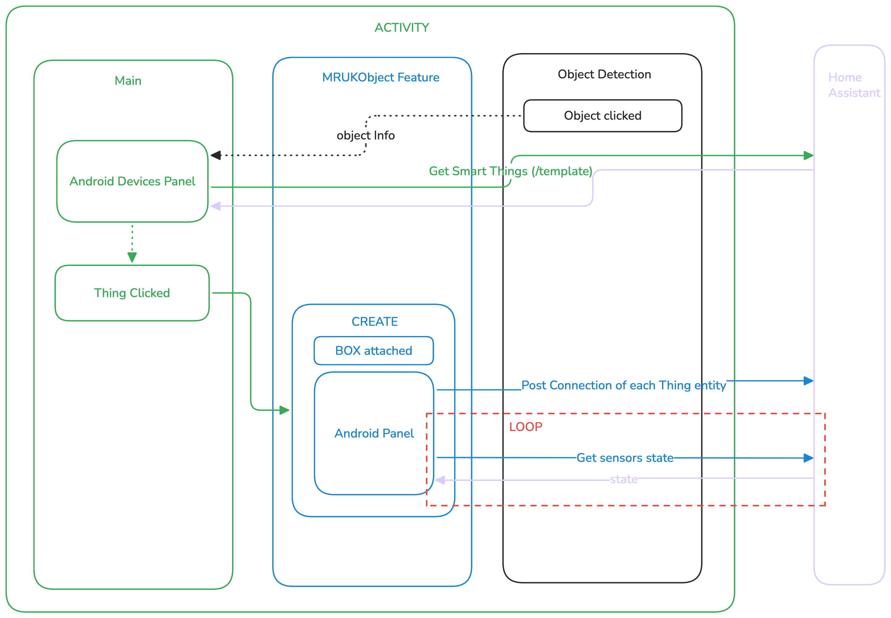
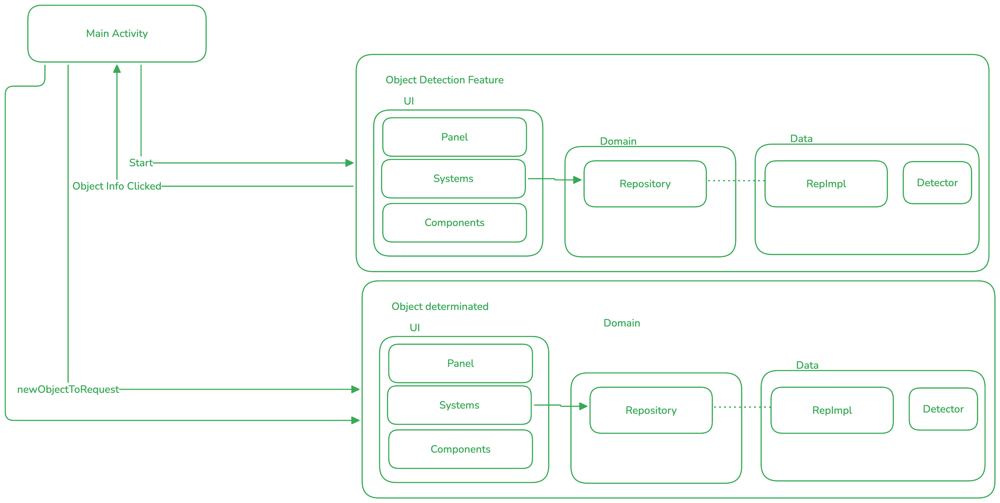
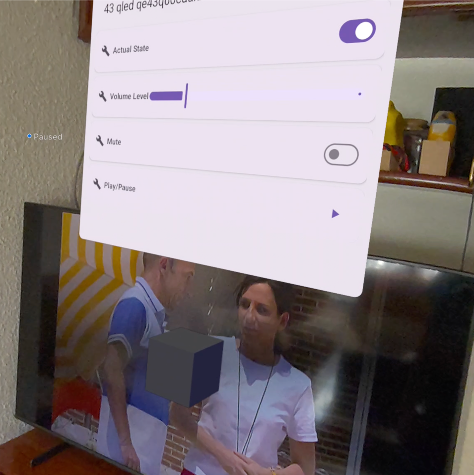

# Meta Spatial Scanner for Smart Things

Application developed by Javier González Peregrín for demonstration and learning purposes in a
Master's Thesis (TFM) - Master in Computer Engineering at the University of Granada (UGR).

## Brief Description
-----------------
This application is a Mixed Reality example combining Meta Spatial SDK (VR/AR), object detection (ML
Kit/MediaPipe), and Smart Home functionalities. It allows detecting objects in the scene, creating
information panels in 3D space, and persisting/managing entities associated with smart devices.

The project combines scene logic (entities/components/systems), a feature layer (object detection,
MRUK/room mapping), and a small integration with a Smart Home backend/service. For proper operation,
the environment must be correctly configured.

This project employs clean architecture and dependency injection (Koin).

## Table of Contents
------------------------

1. [Main Description](#1-main-description)
2. [How to Run the App](#2-how-to-run-it)
  1. [Requirement: Home Assistant / Smart Home API](#21-need-of-a-home-assistant-installed)
2. [Add new Smart Thing](#22-add-new-smart-thing)
3. [App Architecture (Clean Architecture Applied)](#3-app-architecture-clean-arch-on-app-and-features)
4. [Dependency Injection with Koin](#4-dependency-injection-with-koin)
5. [Technical Notes and Troubleshooting](#5-technical-notes-and-troubleshooting)

# 1. Main Description
-------------------
The app is based on the Meta Spatial SDK and provides:

- Scene: 3d scene with entities and interactive panels.
- Detection: object detection on camera (ML Kit / MediaPipe) and creation of representative entities
  in the scene.
- Anchoring: capability to "anchor" (MRUK) detected objects in real space and persist their
  position/orientation.
- Components: a `FollowHead` component that makes panels face the user's headset.
- Persistence: local storage (Room) to remember the pose (Pose) of each added device.

**Main Use Cases:**

- Detection: detect an object in the camera and show an anchored information panel in the scene.
- Storage: save the panel/device pose in SQLite (Room) to restore it later.
- Management: add, update, and remove persisted objects from the UI or code.

An example of how different features and the Home Assistant interact is:




# 2. How to run it
-----------------
**Prerequisites:**

- Hardware: meta Quest 3 or higher with Meta Spatial development environment configured.
- Environment: jdk 17, NDK used 29.0.14206865.
- Android: android SDK / Android Studio (recommended) with API versions indicated in
  `app/build.gradle.kts`.
- Server: a Home Assistant server to perform queries on real devices.

**Configure Sensitive Variables:**

The project reads `HTTP_API` from `gradle.properties`/`secrets.properties` (see
`app/build.gradle.kts`). Place the URL or token in `local.properties` if the flow requires the Smart
Home API.

Also update `app/src/main/res/xml/network_security_config.xml` with the known IP.

**Useful Commands (from repo root):**

```bash
# Clean and compile the app
./gradlew :app:clean :app:assembleDebug

# Install on connected device (if configured)
./gradlew :app:installDebug
```

También puedes abrir el proyecto en Android Studio y ejecutar/depurar normalmente.

## ** [User Manual](documentation/MANUAL.md)**


## 2.1 Need of a Home Assistant installed
-------------------------------------
Some functionalities depend on a Smart Home service (API) to obtain device metadata or execute
actions. It is expected that:

- Service: you have an accessible Smart Home service (e.g., Home Assistant or a mock REST API).
- Configuration: you pass the URL/token to the build via `secrets.properties` or the `HTTP_API`
  variable.

Without this service, device-related functionalities may degrade to a local mode (mock), but object
detection and AR/VR interaction will continue to function locally.

The main types of supported smart devices are:

- Lights: smart lights.
- Plugs: smart plugs.
- Media: smart media players.
- Weather: weather stations.

## 2.2 Add new Smart Thing:

Add to Domain interface, then create how to fetch it in the Domain Mapper with the Attributes (if
needed).

Highly recommended to use one of the existing Domains as template or even to use it if it only
differs in some attributes.

You can
check [Adding a Weather Station Smart Thing](https://github.com/javigp2002/spatial_sdk/pull/10) as
example.


# 3. App Architecture (clean arch on app and features)
---------------------------------------------------
The project follows a structure with separation of concerns and a "clean architecture" concept for
features:

- App: `app/` - main layer and configuration (Main Activity, systems/components registration,
  Spatial SDK configuration).
- Features: `feature/*` - each feature contains its own separation:
  - Domain: `domain/` - models and contracts (repository interfaces, use cases if applicable).
  - Datasource: `datasource/` - concrete implementations (network, local/Room). Concrete mappers and
    repositories are found here.
  - Presentation: `presentation/` or `ui/` - UI/compose elements (where applicable) and scene entity
    managers.

**Practical Example in this Repo:**

- Feature: `feature/MRUKSidePanelRaycasterFeature` - responsible for saving/retrieving MRUK
  entities (scene anchors). It has:
  - Domain: `domain/repository/IMRUKObjectsRepository` (high-level contract).
  - Datasource: implementation `MRUKObjectsRepositoryImpl` which orchestrates entity creation in the
    scene and local persistence.
  - Local: `datasource/local` - Room implementation (`MrukEntity`, `MrukDao`, `MrukDatabase`,
    `MrukLocalDatasource`).

- Detection: `feature/objectdetection` - detection logic with ML Kit/MediaPipe and panel creation.
  Maintains its own datasource and repository layer to separate responsibilities.

**Benefits of this Approach:**

- Testing: easy testing of domain logic by mocking repositories.
- Substitution: replacement of implementations (e.g., using another backend or persistence) without
  breaking UI logic.

# 4. Dependency Injection with Koin
--------------------------------
The project uses Koin for dependency injection (DI). Main modules and singletons are registered in
`DiApplication.kt`.

**What is registered in Koin (examples):**

- Repositories: feature repositories (e.g., `IMRUKObjectsRepository` → `MRUKObjectsRepositoryImpl`).
- Datasources: concrete datasources (e.g., `MrukLocalDatasource` which wraps `MrukDao`).
- Network: network clients (e.g., `SmartHomeApi`) and utilities.

**How to extend/add bindings:**

- Add: add an entry in `appModule` within `DiApplication.kt`.
- Use: use `get()` to resolve necessary dependencies in the implementation.

**Short Usage Example in Code:**

```kotlin
class SomeFeature(private val repo: IMRUKObjectsRepository) {
  suspend fun add(model: MrukRaycastModel) {
    repo.addMRUKObject(model)
  }
}

// in Koin module:
// single<IMRUKObjectsRepository> { MRUKObjectsRepositoryImpl(get(), get()) }
```

# 5. Technical Notes and Troubleshooting
----------------------------------

- Room: the `app` module includes Room (dependencies and KAPT).
- Components: there is a `FollowHead` component and a `FollowHeadSystem` that forces panels to look
  at the headset.
- Resources: some component IDs are generated from `app/src/main/components/*.xml`. If changes are
  introduced in those schemas, rebuild the project to regenerate classes/IDs.
- Dependencies: check `libs.versions.toml` and `app/build.gradle.kts` if Meta Spatial SDK versions
  need updating.

# Contact / Contributions
-------------------------
This work started as a fork
of [Spatial Scanner](https://github.com/meta-quest/Meta-Spatial-SDK-Samples) and changes have been
made regarding it.