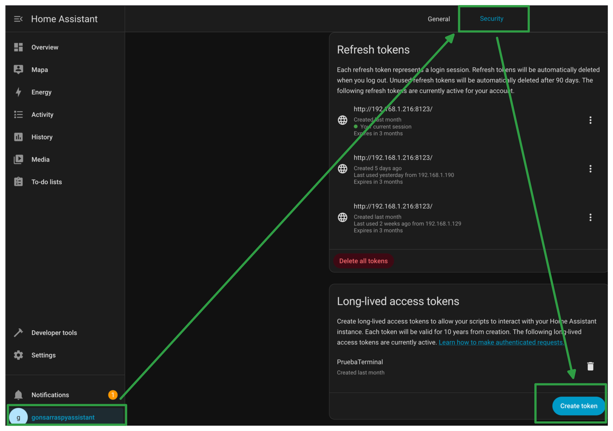
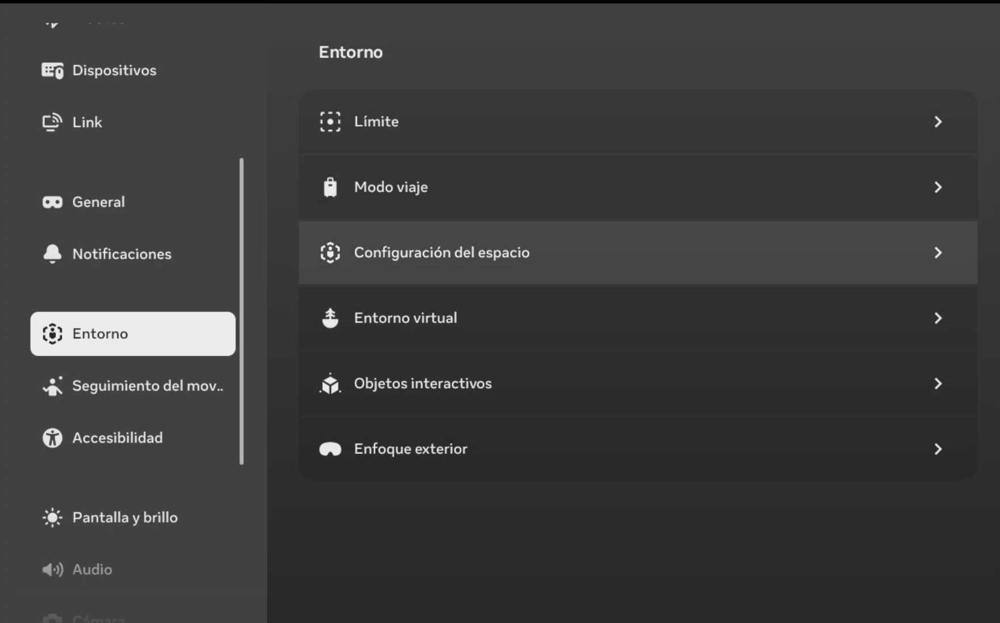
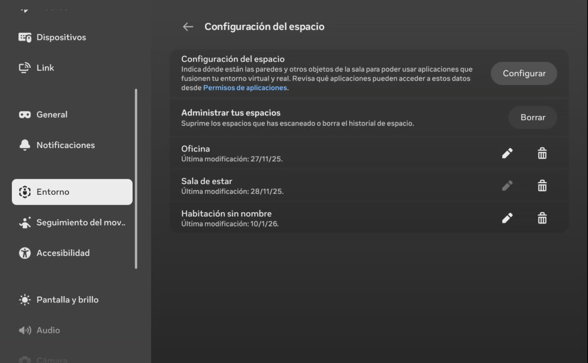
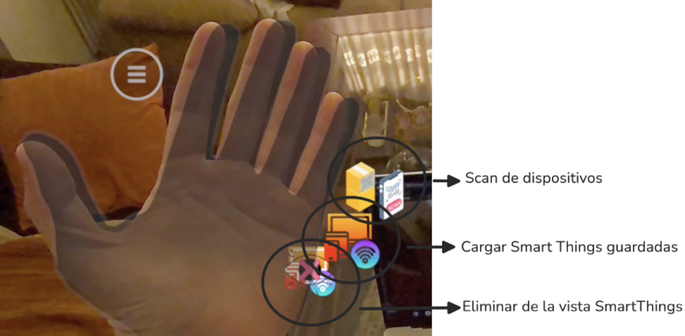
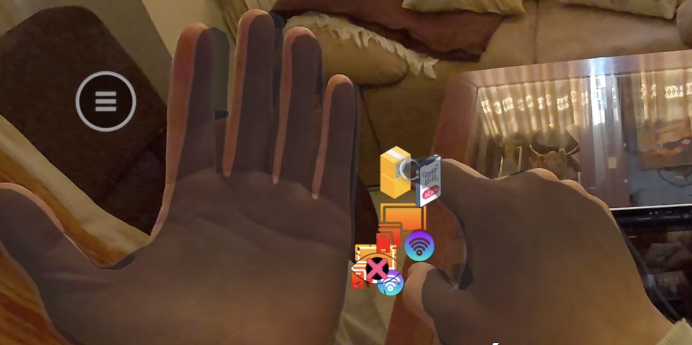
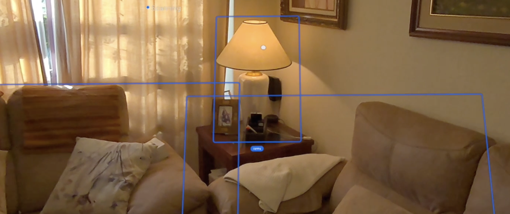
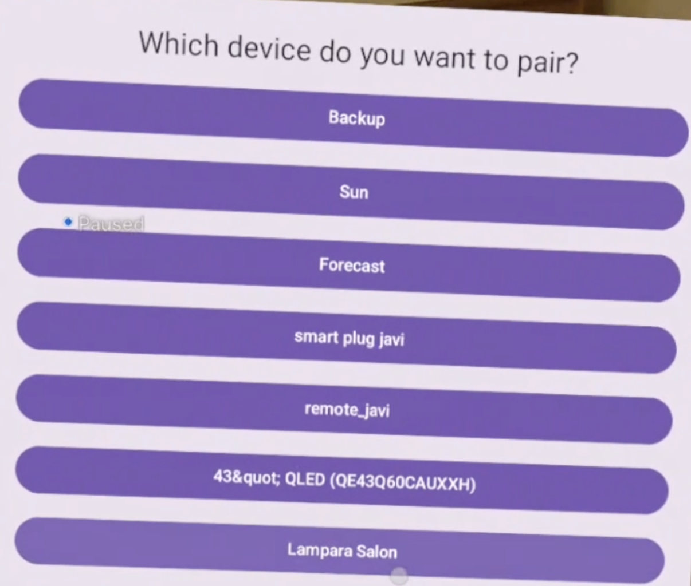
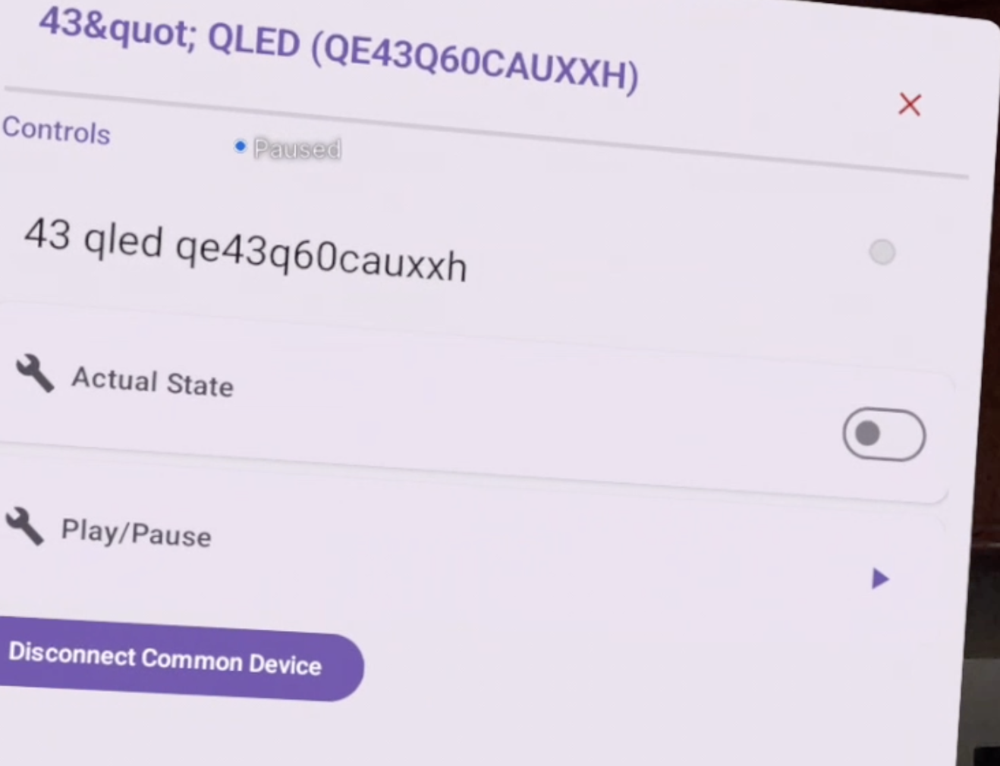

# User manual

All decisions executed in this project, along with the fundamental aspects
developed through software engineering, have resulted in a functional application usable
by those with the necessary resources.

# Tech configuration

## Home Assistant

This project combines Mixed Reality in home automation with Artificial Intelligence. It is necessary
to have the appropriate resources to use the application.

- Server: create the Home Assistant server on a compatible device, such as a Docker container.
- Network: access the network to find the server IP and add it to `local.properties`.
- Token: access the web application after configuring Home Assistant and obtaining its IP. In the
  `Profile > Security` section, create a _Long-Lived Access Token_ to access the API. This token
  must be added to `local.properties`.



Finally, update the IP in the file `app/src/main/res/xml/network_security_config.xml`. The
`local.properties` file must look like this:

```
HTTP_API=http://192.168.X.X:8123/api
HTTP_TOKEN=YOUR_LONG_LIVED_ACCESS_TOKEN
``` 

## Multimodal System

To determine the location of virtual objects, it is necessary to know the environment. When starting
the application, you must scan the environment with the device or have a previous scan ready.

From the Meta Quest 3 settings, access the environment configuration to perform the scan.

Meta will present the final scan for validation before continuing.



# Application Usage

After configuration, start the application on the Meta Quest 3. It will request permission to access
the network (communication with Home Assistant) and the environment. After accepting, the
application will start.

Control resides in the user's hands to interact with panels and activate buttons.

The left hand shows three buttons with different functionalities when facing the device. These are
activated with the opposite hand.



## Scan button

Represented by a scanner icon. It allows you to rescan the environment to recognize interactable
objects. When pressed, transparent panels appear over recognizable objects.


An information panel will appear next to the identified object to assign the corresponding smart
device.


The recognized object will remain associated and saved in memory to the selected smart device,
allowing interaction through Mixed Reality.

To unlink or hide the panels, use the buttons integrated into each panel:



## Load Smart Things button

Retrieves all panels identified with associated Smart Things and shows them in the environment to
interact without needing a prior scan.

## Clear Smart Things button

Removes the panels associated with Smart Things from view, maintaining the internal association
between the object and the smart device.

