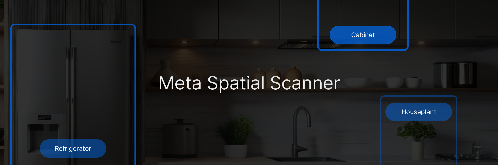
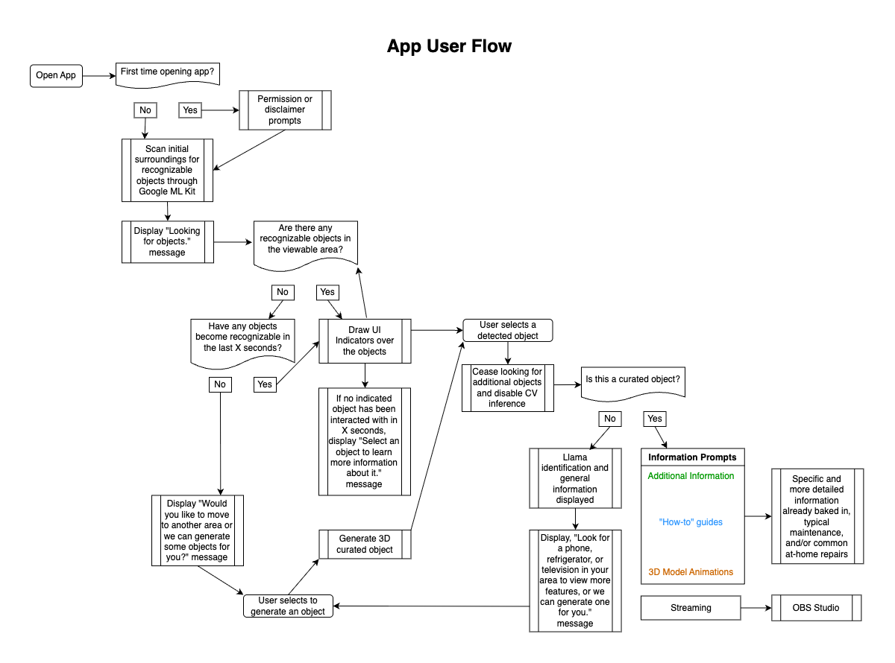
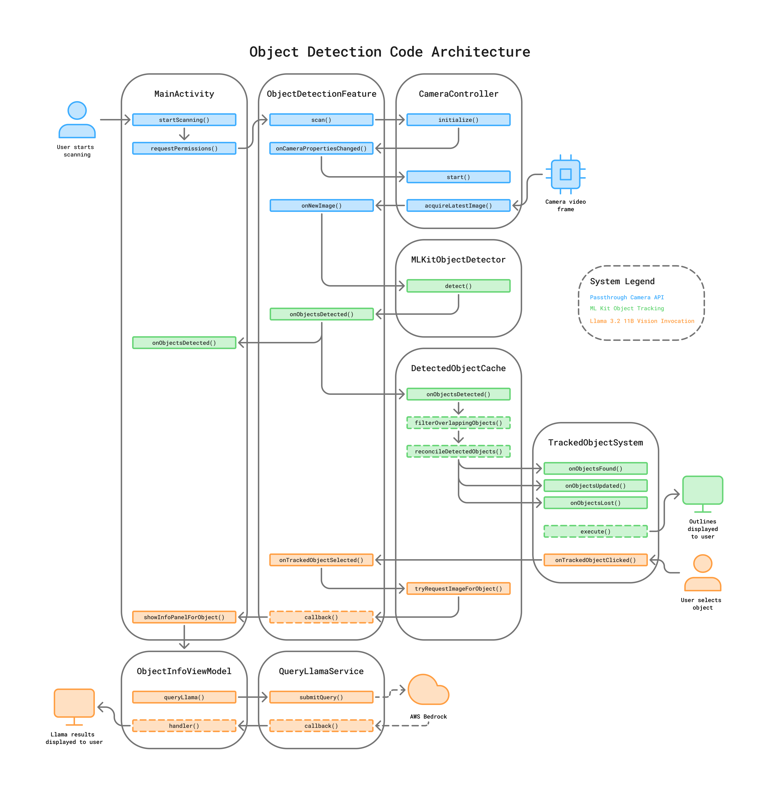
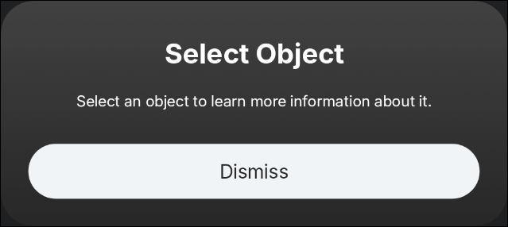
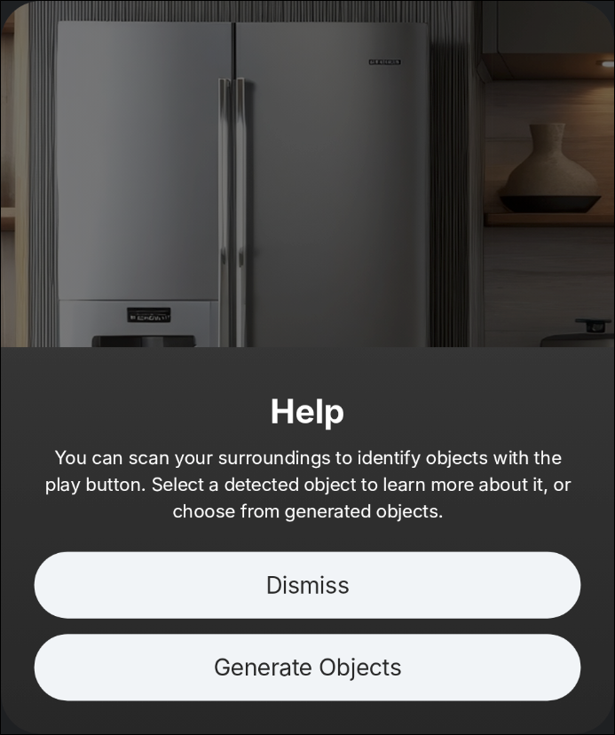
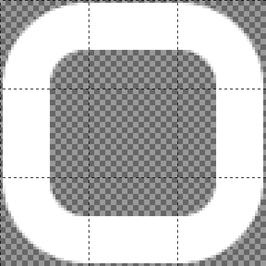

# Meta Spatial Scanner



**Meta Spatial Scanner** is a mixed reality app designed to showcase some of the features of [Meta's Spatial SDK](https://developers.meta.com/horizon/develop/spatial-sdk/), and demonstrate to developers how to create immersive and engaging apps for the Meta Quest. This app also serves as a starter project which brands or agencies can build upon to showcase new technical capabilities that utilize the headset camera, such as for live streaming, live customer assistance for goods and services, or realtime on-device Computer Vision (CV) analysis of the user's surroundings.

This app enables you to scan your environment and identify items in your home, as well as access more information about them. Scan your kitchen to learn more about how to properly maintain your new fridge, scan your living room to learn how to troubleshoot connectivity issues on your TV, and scan your new smartphone to understand more about its features and settings.

Some goals of this project include:

- Develop enjoyable experiences that help developers think about new ways to utilize the Spatial SDK.
- Create an open-source project that demonstrates Spatial SDK's [Passthrough Camera API](https://developers.meta.com/horizon/documentation/spatial-sdk/spatial-sdk-pca-overview) and helps developers understand how to implement it.
- Provide documentation that helps developers navigate the project and understand the possibilities of Spatial SDK.

This document provides a high-level overview of the application architecture and features, as well as the potential uses of the Spatial SDK Camera Passthrough API.

## Key Features

1. **Passthrough Camera API** – access the forward-facing cameras on the Quest 3 and Quest 3S for livestreaming or CV inference.
2. **ML Kit Object Tracking** – perform realtime on-device detection and labeling of objects in the user's field-of-view.
3. **Llama 3.2 11B Vision Invocation** - utilize Meta AI as a cloud service to get more in-depth details of an object detected in the user's surroundings.

More in-depth documentation on the implementation of key features within the app can be found in the official Horizon documentation [here](https://developers.meta.com/horizon/documentation/spatial-sdk/spatial-sdk-scanner-overview). Some of the implementations in this project are considered proof-of-concept, and may require additional functionality or development before integrating into a production app.

## Performance and Energy Consumption

Note that using the Passthrough Camera API to start a camera session and read video frames incurs a performance and energy consumption hit. To combat that in this app, care was taken to run the camera session and image reading on background threads to prevent stuttering on the main UI thread, and to stop and close the camera session immediately once the user selects a detected object. Make sure to follow the best practices outlined in the [Spatial SDK documentation](https://developers.meta.com/horizon/documentation/spatial-sdk/spatial-sdk-pca-overview) when utilizing the Passthrough Camera API and on-device video frame image processing – such as by performing CV inference.

# Table of Contents

- [Meta Spatial Scanner](#meta-spatial-scanner)
  - [Key Features](#key-features)
  - [Performance and Energy Consumption](#performance-and-energy-consumption)
- [Table of Contents](#table-of-contents)
- [Getting Started](#getting-started)
  - [AWS Bedrock Setup](#aws-bedrock-setup)
  - [AWS Access Key](#aws-access-key)
  - [Adding Your App Secrets](#adding-your-app-secrets)
  - [NDK Installation](#ndk-installation)
- [User Flow](#user-flow)
- [App Architecture](#app-architecture)
  - [Main Scene Composition](#main-scene-composition)
  - [Key Features](#key-features-1)
  - [Additional Features](#additional-features)
    - [Curated Object Content](#curated-object-content)
    - [Interaction SDK](#interaction-sdk)
    - [Wrist-Attached Controls](#wrist-attached-controls)
    - [Tips \& User Guidance](#tips--user-guidance)
    - [Custom Shaders](#custom-shaders)
- [Dependencies](#dependencies)
- [License](#license)

# Getting Started

Before attempting to load and run this project, please follow the official [getting started](https://developers.meta.com/horizon/documentation/spatial-sdk/spatial-editor-create-app-content) documentation for Meta's Spatial SDK, and ensure you are familiar with the Spatial SDK's [framework architecture](https://developers.meta.com/horizon/documentation/spatial-sdk/spatial-sdk-architecture). Additionally, this app uses Meta's Spatial Editor

A core part of this application is its ability to invoke Meta's Llama 3.2 11B Vision LLM to learn more information about objects detected in the user's surroundings. In order to build and run this application, the steps outlined below should be followed to ensure Llama invocation functions correctly.

This application currently only supports invoking Llama via [AWS Bedrock](https://aws.amazon.com/bedrock/) – AWS's solution for invoking various LLM models, as well as the capability to train and upload custom models for querying. This option has a [cost](https://aws.amazon.com/bedrock/pricing/) associated with it which should be considered when determining which model invocation technology you may wish to implement in your application.

## AWS Bedrock Setup

Before beginning, you must first [create an AWS account](https://aws.amazon.com/resources/create-account/) if you don't already have one, or request that one by provisioned to you by your organization's AWS admin. Then follow the steps below to get access to the Llama 3.2 model:

1. Login to the AWS console, and navigate to the Bedrock service.
2. Near the bottom of the left side navigation column, select the `Bedrock configurations/Model access` menu item. Scroll down to make sure that access has been granted to the Llama 3.2 11B Vision Instruct model. If not, select the "Modify model access" button at the top of the page, and follow the steps to gain access.
3. Because the AWS foundation model Llama 3.2 Instruct uses geofencing, we'll also need to enable a Bedrock Cross-region inference. Navigate to the Cross-region inference page in the AWS console - also accessible via the left side navigation column when viewing the Bedrock service page. Search for the model `US Meta Llama 3.2 11B Instruct`, and select the name of the inference profile result. Make sure that the status is "Active", or follow [the AWS documentation](https://docs.aws.amazon.com/bedrock/latest/userguide/cross-region-inference.html) on enabling cross-region inference.

## AWS Access Key

The next set of steps describes how to generate an access key and secret to use when invoking the Llama 3.2 model:

1. Create a custom permissions policy which allows the `bedrock:InvokeModelWithResponseStream` action on the foundation model and inference profile resources for the Llama 3.2 Vision Instruct model. Follow [these instructions](https://docs.aws.amazon.com/IAM/latest/UserGuide/access_policies_create.html) to create the policy, and remember the name you've given the policy – e.g. `InvokeBedrockLlama3Model`. Your policy JSON should look similar to this:

```json
{
    "Version": "2012-10-17",
    "Statement": [
        {
            "Sid": "VisualEditor0",
            "Effect": "Allow",
            "Action": [
                "bedrock:InvokeModelWithResponseStream"
            ],
            "Resource": [
                "arn:aws:bedrock:*::foundation-model/meta.llama3-2-11b-instruct-v1:0",
                "arn:aws:bedrock:*:*:inference-profile/us.meta.llama3-2-11b-instruct-v1:0"
            ]
        }
    ]
}
```

2. Next, follow the [instructions here](https://docs.aws.amazon.com/IAM/latest/UserGuide/id_users_create.html) to create and configure an IAM user.
   1. You may assign a descriptive User name of your choice – e.g. `LlamaServiceAccount`
   2. It is not necessary to grant the user access to the cloud console.
   3. For this new user, assign the policy you just created to the new user.
3. Finally, you must generate an access key for this new AWS IAM user, and save those credentials.
   1. Navigate to the IAM service dashboard, and then select the `Access management/Users` menu item on the left side navigation bar.
   2. Find and select the user you just created to view their account page.
   3. Select the `Security credentials` tab on the mid-page navigation, and scroll down to the `Access keys` card.
   4. Select the "Create access key" button on the right side.
   5. Select the "Other" option as your use-case.
   6. Add a description – e.g. `Service account access key for invoking Llama 3.2 in Spatial SDK project.`
   7. Select the "Create access key" button, and save the "Secret access key" value someplace secure, as you will not be able to access that value after you leave the webpage. You'll need the access key and secret access key in the below step on [adding your app secrets](#adding-your-app-secrets) to the Android project.
4. Note that you should always follow [best practices](https://docs.aws.amazon.com/IAM/latest/UserGuide/id_credentials_access-keys.html) for keeping your access key secure.

## Adding Your App Secrets

The final step is to add the credentials you just created to your project so the AWS Kotlin SDK can be authorized to invoke the model. To do that, you will store the access key and secret in a `secrets.properties` file, which is ignored by git. Those key/value pairs are parsed in the Android project `app/build.gradle.kts` gradle script, and are injected into the application's generated `BuildConfig.java` file to be accessed by the application code. Follow these steps to set that up:

1. Duplicate the `secrets.properties.example` file, and rename it to `secrets.properties`. In this new file (pictured below), replace the values with your access tokens, and the AWS region of the service account (e.g. `us-east-2`).

```properties
# AWS Bedrock keys
AWS_REGION=XX-XXXX-X
AWS_BEDROCK_ACCESS_KEY=XXXXXXXXXXXXXXXXXXXX
AWS_BEDROCK_SECRET_KEY=XXXXXXXXXXXXXXXXXXXXXXXXXXXXXXXXXXXXXXXX
```

## NDK Installation

This app uses custom shaders which the Meta Spatial Plugin compiles at build time using the `glslc` executable bundled with the Android NDK. In order to build and run this app, a recent version of the NDK must be installed and findable on your machine – usually via the SDK Manager if using Android Studio. The installed NDK version musta also be specified in the `:app/build.gradle.kts` using the `ndkVersion` property of the defaultConfig.

# User Flow

The general user flow for this app, including the object detection scanning and spawning of the various panels, is illustrated in the diagram below.



# App Architecture

**Object Detection**

For ease of adoption into other projects, all Kotlin code in this app required for the object detection functionality has been isolated into the `com.meta.pixelandtexel.scanner.objectdetection` package. This includes all code for accessing the device camera, detecting and labeling objects in the user's surroundings, and listening to user selection events of tracked objects. Additionally, the following project resources are referenced from code in the `objectdetection` package, and would also need to be copied into other projects (or replaced) to adopt this feature:

- `res/drawable/rounded_box_outline.png` – used to render a 9-slice outline around detected objects.
- `res/layout/ui_camera_view.xml` – used to display a debug view of the device camera feed and detected object outlines in front of the user.
- `res/layout/ui_camera_status_view.xml` – a simple Android view that displays the current camera scanning status.
- Additionally, some key/value pairs from the following files are used:
  - `res/values/constants.xml` – ids of some object detection panel types.
  - `res/values/strings.xml` – some strings for UI and image content descriptions.
  - `res/values/styles.xml` – panel style for object detection related panels.

**UI & Panels**

For most of the UI content in the various app panels – especially those which use Jetpack Compose – the MVVM architectural pattern is used to separate the displayed panel content from the panel behavior and back-end logic. The code for these panels is separated into the standard `models`, `views`, and `viewmodels` packages. Additionally, a small number of simple panels, or those with Android View specific UI elements, have been built with traditional Android XML, and are located in the `res/layout` directory.

In addition to the panels located in 3D space, there are two panel types that are locked to the user's field of view: the camera status, and an optional debug view of the device camera feed and detected object outlines. Both of these panels are registered and controlled by the code in the `objectdetection` feature package, and are also located in `res/layout`.

Instead of directly using [Material Design](https://m3.material.io/) for the styling and layout of the UI included in this app, the Horizon UI Set was used, which resulted in a look and feel that closely matched that of the Horizon OS system UI.

**Services**

Another notable code package is the `services` package. It contains classes and static objects which perform some of the core logic of the app aside from object detection. This includes invoking Llama, running an embedded HTTP server for live streaming, accessing persistent local settings, displaying tips and handling user guidance, and managing "curated" objects, or those with pre-assembled content. These services, like all other code files in the project, are well documented to provide in-code explanations of their logic and implementation.

## Main Scene Composition

This project utilizes the Meta [Spatial Editor](https://developers.meta.com/horizon/documentation/spatial-sdk/spatial-editor-overview/) for scene composition. The main scene – located at `app/scenes/Main.metaspatial` – is loaded at app start, and contains the following objects:

- **Fridge** – a 3D model of a refrigerator, including PBR materials and two skeletal animations. One of the three "curated" objects, which is displayed when the user detects an object of this type in their surroundings.
- **TV** – a 3D model of a flatscreen television, including PBR materials and two skeletal animations. One of the three "curated" objects, which is displayed when the user detects an object of this type in their surroundings.
- **Phone** – a 3D model of a touchscreen smartphone, shaded with PBR materials. One of the three "curated" objects, which is displayed when the user detects an object of this type in their surroundings.
- **WelcomePanel** – a panel which is displayed when the user first loads the application. It initially shows a disclaimer (unless the user has already accepted the notice during a previous app session), and then shows a screen with a description of how to access the camera controls accompanied with an animated graphic demonstrating the action.
- **CameraControlsPanel** – a simple one button panel which is anchored to the user's left wrist, and can be selected to toggle the object detection scanning on and off.
- **HelpButtonPanel** – a simple one button panel which is anchored to the user's left wrist, and can be selected to view a dynamically spawned help panel providing a brief description of how to use the app, as well as an option to view the "curated" objects.

To make changes to the scene loaded by the app, open the main scene file, make your changes, select `File/Export GLXF`, overwrite the file located at `app/src/main/assets/scenes/Composition.glxf`, and reassemble the app.

## Key Features

The core experience for users of this app is the ability to scan your surroundings and learn more about objects detected in your vicinity. While this feature has potential for many different applications, it is being utilized in this app in two ways: leveraging Meta AI to learn more about any detected objects, and displaying curated content and interactions for specific objects or products. There are three main processes which execute in order to create this feature:

1. [Passthrough Camera API](documentation/PassthroughCameraAPI.md)
2. [ML Kit Object Tracking](documentation/MLKitObjectTracking.md)
3. [Llama 3.2 11B Vision Invocation](documentation/LlamaVisionInvocation.md)

The first two are encapsulated into a single package for ease of adoption into other projects (more on that [here](#app-architecture)), and can both be easily integrated into other Spatial applications by registering an instance of the `ObjectDetectionFeature`, a custom [SpatialFeature](https://developers.meta.com/horizon/documentation/spatial-sdk/spatial-sdk-spatialfeature), in your main activity.

The following diagram illustrates the execution of the processes listed above, and how they interact with each other. Follow the links in the list above to learn more about each process individually.



## Additional Features

### Curated Object Content

In addition to granting the user the ability to learn more about scanned objects by utilizing Meta AI CV, this app has three "curated" objects which, if found in the user's environment, will display a 3D model of the item, plus pre-assembled panel image and copy content. Two of the three curated objects – fridge and tv – also include skeletal animations which play as the user interacts with the panel. This demonstrates how panel interactions could be used to control behavior of 3D objects, and serves as a proof of concept for how brands could preload their apps with curated content and 3D models of their products, and display in-depth information or troubleshooting to consumers for those products.

Instead of baking in all of the curated panel content for each curated object into separate Jetpack Compose screens, all images and copy for the objects are configured in xml, and loaded at app start. Then, when the user selects a curated object, the proper UI layout type and content is dynamically displayed based on the UI configuration in the xml. For this app, two panel layout types were created, but this implementation demonstrates scalability.


The core files for this feature are:

```
models/CuratedObject.kt
viewmodels/CuratedObjectInfoViewModel.kt
services/CuratedObjectHandler.kt
...
views/objectinfo/CuratedObjectImageCopyPanel.kt
views/objectinfo/CuratedObjectInfoScreen.kt
views/objectinfo/CuratedObjectTilesPanel.kt
...
res/xml/objects.xml
```

### Interaction SDK

The [Interaction SDK (ISDK)](https://developers.meta.com/horizon/documentation/spatial-sdk/spatial-sdk-isdk-overview) is a feature of the Spatial SDK which brings additional touch and manipulation control to users. This feature is integrated into this app, and provides an easy way for users to move and interact with panels and 3D objects. More can be read about this feature in the official documentation.


### Wrist-Attached Controls

An essential part of the target user experience of this app is the ease at which app controls – such as turning the camera scanning on and off – can be accessed. This could have been accomplished with a controller button that toggles an action menu, or a UI panel that was tethered to the user or fixed in their view, but these solutions have limitations. Instead, a custom [Entity Component System (ECS)](https://developers.meta.com/horizon/documentation/spatial-sdk/spatial-sdk-ecs) component and system were written to anchor panel buttons near the user's wrist position and orientation. This positioning, in conjunction with the ISDK integration which adds touch support to panels, allows users to quickly access app controls and change app state without even pressing any buttons.

The `WristAttached` component is generic enough that it could be used for other applications, and includes logic to show and hide wrist-attached entities if the user's palm isn't facing their head, or if the user isn't looking at their palm.


The core files for this feature are:

```
ecs/WristAttachedSystem.kt
...
app/src/main/components/WristAttached.xml
```

### Tips & User Guidance

An important goal of any user-engaging application should be to guide their users through the features and target experience. To that end, a tip system was built into this app. Several panels with helpful tips and guidance are displayed to the user at different times, depending on app usage and user behavior. In this implementation, all key app and user events are listed in the `UserEvent` enum class, and recorded in the `TipManager` – which determines when and if to trigger these tip panels.



The core files for this feature are:

```
services/TipManager.kt
...
views/tips/FindObjectsScreen.kt
views/tips/HelpScreen.kt
views/tips/NoObjectsDetectedScreen.kt
views/tips/SelectObjectTipScreen.kt
```

In addition to timed and triggered tip panels, a Help screen with guidance on how to use the app in general was created for this app, and is accessible via a wrist-attached question mark '?' button. This provides a way for users to get help at any time. Giving users agency to access guidance is better practice than relying solely on pre-timed and triggered events. Or better yet, include both!



### Custom Shaders

In addition to the built-in PBR materials, the Spatial SDK supports [custom written shaders](https://developers.meta.com/horizon/documentation/spatial-sdk/spatial-sdk-custom-shaders). This app uses two custom shaders – `customPanel` and `9slice` – which are compiled and loaded into the app at runtime.

The `customPanel` shader is included simply as an example of how you could apply a custom shader to your panel to alter its final look and feel. The shader currently doesn't render the panel any differently than the built-in panel shader. It is referenced in MainActivity, and is being used to render the WelcomeScreen panel by setting `effectShader = "customPanel.frag"` on the PanelRegistration config. Other applications could implement this feature to alter the exposure, tonemapping, or tint of their panels.

The `9slice` shader is an implementation of [9-slice scaling](https://en.wikipedia.org/wiki/9-slice_scaling), and is used by this app to render outlines around objects detected in the user's environment, without stretching the corners of the source outline image. See the custom ECS system function `ecs/OutlinedSystem::createNewOutlineMaterial` for an example of how to initialize a material with this custom shader.




The custom shader files are:

```
app/src/shaders/9slice.frag
app/src/shaders/9slice.vert
app/src/shaders/customPanel.frag
```

# Dependencies

- [Meta's Spatial SDK](https://developers.meta.com/horizon/develop/spatial-sdk/)
- Meta Spatial UI Set – for Jetpack Compose UI styling and Horizon OS icons and typography.
- [Google ML Kit Object Detection Vision API](https://developers.google.com/ml-kit/vision/object-detection) – for on-device object detection and tracking in the device live camera feed.
  - (optional) [Google Mediapipe](https://ai.google.dev/edge/mediapipe/solutions/vision/object_detector) can be used in place of ML Kit for object detection, but this implementation currently does not support persistent tracking across video frames.
  - (optional) [Open CV](https://opencv.org/) can be used in place of ML Kit for object detection, but this implementation currently does not support persistent tracking across video frames.
- [AWS Kotlin SDK](https://github.com/awslabs/aws-sdk-kotlin) – for integrating AWS Bedrock for Llama 3.2 invocation.
- [gson](https://github.com/google/gson) – for deserializing JSON response objects from AWS Bedrock.
- [Jetpack Compose](https://developer.android.com/compose) - for building modern Android UI with Material Design support.
- [compose-markdown](https://github.com/jeziellago/compose-markdown) – for displaying markdown-formatted text in Jetpack Compose.

# License

This project is licensed under the [MIT License](LICENSE), as found in the LICENSE file.
