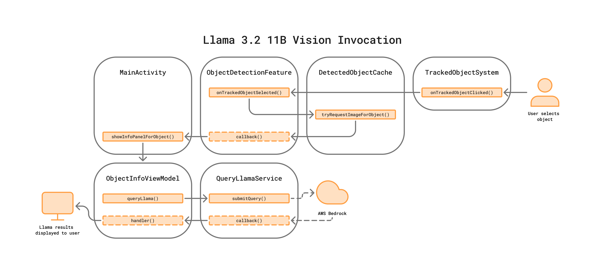

# Llama 3.2 11B Vision Invocation

This app utilizes Meta's [Llama 3.2 11B Vision model](https://www.llama.com/docs/model-cards-and-prompt-formats/llama3_2/#-llama-3.2-vision-models-(11b/90b)-) to allow users to learn more about an object detected in their surroundings.


A singleton service `QueryLlamaService` has been created which, along with its dependencies, can easily be adopted by other applications to support the same capability.

```
services/llama/models/BedrockRequest.kt
services/llama/models/BedrockResponse.kt
services/llama/IQueryLlamaServiceHandler.kt
services/llama/QueryLlamaService.kt
```

# Table of Contents

- [Llama 3.2 11B Vision Invocation](#llama-32-11b-vision-invocation)
- [Table of Contents](#table-of-contents)
- [AWS Bedrock](#aws-bedrock)
- [Querying](#querying)
  - [Model Parameters](#model-parameters)
  - [Response Streaming](#response-streaming)
- [Example Usage](#example-usage)

# AWS Bedrock

This app utilizes the [AWS Kotlin SDK](https://sdk.amazonaws.com/kotlin/api/latest/bedrockruntime/index.html) and the [AWS Bedrock](https://aws.amazon.com/bedrock/) cloud service to invoke Llama and receive a response. Using AWS Bedrock requires access key and secret key authentication. Additional info and instructions for setting up those keys can be found in the Getting Started section of this repo's main README.

The AWS Kotlin SDK supports 3 parameters when invoking Meta's Llama model: `temperature`, `top_p`, and `max_gen_length` – as described [here](https://docs.aws.amazon.com/bedrock/latest/userguide/model-parameters-meta.html#model-parameters-meta-request-response). How these parameters are configured is explained below in [Model Parameters](#model-parameters).

The Kotlin representation of the AWS Bedrock request payload is located in the file `/services/llama/models/BedrockRequest.kt`, and is serialized into JSON by the [gson](https://github.com/google/gson) dependency before being passed to the AWS Kotlin SDK. Constructing the AWS Bedrock request payload requires using Llama 3's vision [instruction format](https://github.com/meta-llama/llama-models/blob/main/models/llama3_2/vision_prompt_format.md).

```kotlin
/**
 * query: String
 * temp: Float
 * top_p: Float
 */

// embed the prompt in Llama 3's instruction format
val instruction =
    """
        <|begin_of_text|>
        <|start_header_id|>user<|end_header_id|>
        {{prompt}}
        <|eot_id|>
        <|start_header_id|>assistant<|end_header_id|>
    """
    .trimIndent()
    .replace("{{prompt}}", query)

val request = BedrockRequest(instruction, null, temp, top_p)

val requestBody = gson.toJson(request)
val nativeRequest = InvokeModelWithResponseStreamRequest {
    modelId = "us.meta.llama3-2-11b-instruct-v1:0"
    contentType = "application/json"
    accept = "application/json"
    body = requestBody.encodeToByteArray()
}

bedrockClient.invokeModelWithResponseStream(nativeRequest) {
    // send response to handler
}
```

> Note the null value passed to the `images` parameter of the `BedrockRequest`.

To include an image in a query to Llama for analysis, the image must first be resized so that it has a maximum width and height of 1120 px x 1120 px, and then encoded into a base64 string before being included in the `BedrockRequest`. Additionally, the `<|image|>` tag must immediately precede the text query in the model prompt. Two helper functions have been written in `QueryLlamaService` to handle the image resizing and encoding.

```kotlin
/**
 * query: String
 * imageData: Bitmap
 * temp: Float
 * top_p: Float
 */

// first process and encode the image
val resizedImage = resizeToFit(imageData, 1120, 1120)
val imageString = convertBitmapToBase64(resizedImage)

// embed the prompt in Llama 3's instruction format
val instruction =
    """
        <|begin_of_text|>
        <|start_header_id|>user<|end_header_id|>
        <|image|>{{prompt}}
        <|eot_id|>
        <|start_header_id|>assistant<|end_header_id|>
    """
    .trimIndent()
    .replace("{{prompt}}", query)

val request = BedrockRequest(instruction, listOf(imageString), temp, top_p)

// ...
```

> Note the `listOf(imageString)` passed to the `images` parameter of the `BedrockRequest`.

# Querying

The main entry point to using this service is the `submitQuery()` object function. An overloaded `submitQuery()` function, which only uses text, is included but unused by this application. As illustrated in the following diagram, taken from the [Object Detection Code Architecture diagram](media/diagram-0-object-detection-code-architecture.png), querying is performed in the `ObjectInfoViewModel`.



After the user has selected an object detected in their surroundings, an `ObjectInfoRequest` model is initialized with the label of the identified object, and a bitmap image of the object cropped from the user's camera feed. That `ObjectInfoRequest` instance is then passed to a view model of a new panel that spawns to display the object image and Llama response.

## Model Parameters

As noted above, 2 parameters are being used in the model invocation implementation in this app: `temperature` and `top_p`. An in-depth explanation of these parameters, and how they affect query responses, is out-of-scope for this documentation, but a brief explanation follows:

`temperature` – the creativity level of the model. A low value of 0.1 was chosen for this parameter to have less randomness overall, and higher predictability.

`top_p` – the diversity level of the model. A high default value of 0.9 for this parameter was chosen to have greater diversity in the responses.

Choosing the right model invocation parameters really comes down to the use-case of the application, and the values for this app were chosen after much testing to strike a balance between educational and fun.

## Response Streaming

The integration of Llama model invocation in this app makes use of response streaming in order to provide a better user experience. By eliminating the need to wait a longer period of time for the invocation to complete, and by providing progressive visual feedback on the application functions, the user's attention remains engaged by the app. For most situations where a text response is being displayed to the user, this approach is recommended.

> Note that the `internalQuery()` function, which is called by the `submitQuery()` functions, is a suspending function, and should be called from within a Coroutine.

# Example Usage

```kotlin
/**
 * infoRequest: ObjectInfoRequest
 * queryTemplate: String
 */

CoroutineScope(Dispatchers.Main).launch {
    val query = queryTemplate.replace("{{object_name}}", infoRequest.name)

    QueryLlamaService.submitQuery(
        query, infoRequest.image, handler =
            object : IQueryLlamaServiceHandler {
                override fun onStreamStart() {
                    // hide loading message/graphic
                }

                override fun onPartial(partial: String) {
                    // update result UI with partial response
                }

                override fun onFinished(answer: String) {
                    // update result UI with full, final response
                }

                override fun onError(reason: String) {
                    // handle querying error
                }
            })
}
```

To see an example usage of this service in the app, see the file `viewmodels/ObjectInfoViewModel.kt`.
