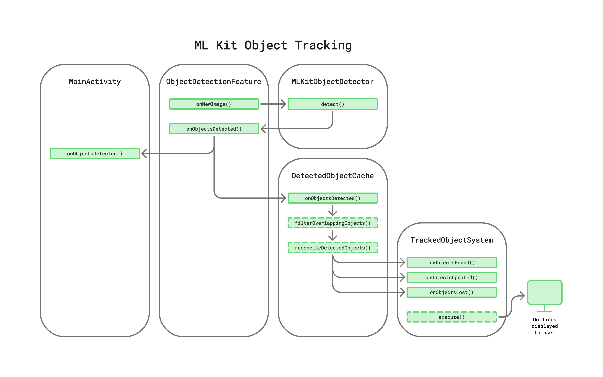

# ML Kit Object Tracking

An essential part of this app's core experience, and a prime use-case for access to the device's camera API, is the utilization of CV and object detection AI models to give users the opportunity to learn more about their surroundings. This capability has many potential use cases: body pose detection for medical applications, real time text recognition and translation, face mesh detection for more accurate AR filters or video chat, brand product recognition to track consumer metrics or impressions, and much more.


This document provides a break-down of how CV model inference was implemented in and used by this app for realtime, on-device object detection and tracking, and ideally serves as a starting point for integrating CV inference into other applications. All of the Kotlin code for object tracking is siloed into the `objectdetection` package for easier adoption into other projects.

```
objectdetection/**/*.kt
```

# Table of Contents

- [ML Kit Object Tracking](#ml-kit-object-tracking)
- [Table of Contents](#table-of-contents)
- [Object Detection Options](#object-detection-options)
  - [Model Inference Options](#model-inference-options)
  - [Dataset and Model Options](#dataset-and-model-options)
- [Detected Object Cache](#detected-object-cache)
  - [Filtering Objects](#filtering-objects)
- [Tracked Object System](#tracked-object-system)
  - [Object Pooling](#object-pooling)
  - [Outline Shader](#outline-shader)
- [Debug View and Overlay](#debug-view-and-overlay)
- [Adoption](#adoption)

# Object Detection Options

There are a multitude of options available for image object detection inference, including various datasets, pre-trained models, and model inference software. The vast majority of object detection inference options provide – at a base level – an rectangular bounding box defining the location and extents of the object in the image, and a numeric confidence threshold. More robust options offer support for additional features like object classification or labeling, object segmentation, and object tracking across sequential inferences. Few options provide some or all of these robust features, plus the ability to perform them in realtime, on a device with computational power relatively lower than your high-end desktop GPUs and CPUs.

Choosing the right options should come down to the application's specific use case. For this app, the following criteria were determined in order to select the best options:

1. Must be performant, and capable of completing 15-20 inferences per second on-device.
2. Must include out-of-the-box support for real-time object tracking across sequential inferences, with persistent object IDs.
3. Must be capable of identifying and labeling everyday household and office objects with relative accuracy, especially the three curated objects – refrigerator, television, and smartphone.
4. Must be relatively low level-of-effort to integrate into an Android project, ideally via a Kotlin SDK.
5. Ideally capable of tracking multiple objects at once.

## Model Inference Options

Three options for model inference software were explored during the development of this app. All three satisfied most of the criteria defined above, but only one satisfied criteria 1 and 2 in our testing: ML Kit.

- [OpenCV](https://docs.opencv.org/4.x/d1/dfb/intro.html)
- [Mediapipe](https://ai.google.dev/edge/mediapipe/solutions/vision/object_detector)
- [ML Kit](https://developers.google.com/ml-kit/vision/object-detection)

A number of other options exist that weren't explored, but most others didn't satisfy criteria 4, as they required using [Android NDK](https://developer.android.com/ndk). For this application's use case, and to facilitate exploring different options, some abstractions for these various object detector technologies were implemented.

```kotlin
data class DetectedObject(
    val point: PointF,
    val bounds: Rect,
    val label: String,
    val confidence: Float,
    val id: Int? = null
)

data class DetectedObjectsResult(
    val objects: List<DetectedObject>,
    val inferenceTime: Long,
    val inputImageWidth: Int,
    val inputImageHeight: Int
)

interface IObjectsDetectedListener {
    fun onObjectsDetected(result: DetectedObjectsResult, image: Image)
}

interface IObjectDetectorHelper {
    fun setObjectDetectedListener(listener: IObjectsDetectedListener)
    fun detect(image: Image, width: Int, height: Int, finally: () -> Unit)
}
```

All of these structures are well documented in-code, and are located in the `objectdetection/detector` package. The different inference options that weren't ultimately used in this app – Mediapipe and OpenCV – were left in the project to demonstrate their usage, and hopefully serve as a solid starting point for other applications whose criteria for choosing a model inference technology are satisfied by one of these implementations. You can easily switch between them in `ObjectDetectionFeature` by toggling the commented lines, though it is recommended that you only test these with the `spawnCameraViewPanel` flag set to true.

```kotlin
// different options for object detection; though only MLKit current supports persistent ids
//objectDetector = MediaPipeObjectDetector(activity)
objectDetector = MLKitObjectDetector(activity)
//objectDetector = OpenCVObjectDetector(activity)
```

## Dataset and Model Options

After settling on ML Kit, various options for object detection models were explored. [Kaggle](https://www.kaggle.com/models?task=17074) is a large repository of datasets and models, and conveniently hosts a number of lightweight models that are built for on-device inference, and are compatible with ML Kit. A dozen different models were tested, and four all still included in the project at `app/src/main/assets/models/mlkit/*.tflite`. Each one offers its own advantages and disadvantages in terms of what types of objects it is capable of detecting, how long an inference takes in milliseconds, and how large the model file. Ultimately, the [efficientnet TFLite 4 uint8](https://www.kaggle.com/models/tensorflow/efficientnet/tfLite/lite4-uint8) model was chosen, as it strikes the best balance of criteria satisfaction for this app's use case.

There are, however, many more options that exist on Kaggle or other repositories, and thorough documentation and capability for how to train many of those models with a dataset that is tailored to the needs of other applications.

# Detected Object Cache

While developing this app, the following needs arose, which resulted in the creation of the `objectdetection/DetectedObjectCache.kt`.

1. A central location where the current pool of detected objects is stored and queryable.
2. A means of filtering out detected objects that overlap too much with the bounds of other objects.
3. A way to reconcile the diff between the set of detected objects from the previous video frame with the new set from the latest video frame.
4. A way to emit events notifying others when new objects are detected, existing objects are updated, and existing objects are lost.

The following diagram, taken from the main [Object Detection Code Architecture diagram](media/diagram-0-object-detection-code-architecture.png), illustrates the code execution path which includes performing the object detection inference and displaying the results to the user. Note how the `DetectedObjectCache` is integral in determining which detected objects should be displayed to the user. Also note in the [Llama Vision Integration document](LlamaVisionInvocation.md#querying) the role DetectedObjectCache plays in fetching a cropped image from the latest video frame of a detected object so that it can be sent to Llama for vision analysis via AWS Bedrock.



## Filtering Objects

Filtering out overlapping objects occurs in `DetectedObjectCache`, and is performed to avoid the situation where multiple objects are detected on top of each other, making it difficult for the user to select any one of them in particular. An example of this occurring would be if the user is looking at a multishelf bookcase, and the object detection inference returns results for multiple adjacent shelves – each as "bookshelf" – plus the entirety of the structure as "bookcase". Two different methods of filtering were applied, listed below.

1. If 2 objects intersect, where 1 is completely within the other, remove the interior one.
2. If 2 objects are overlapping, and the intersection area makes up a majority of the smaller of the two, remove it.

These filtering methods eliminated the majority of overlapping issues, while still including partially overlapping bounds, which users could still easily select one or the other. Additional filtering methods could be conceived and implemented in apps which have different use cases – for example, an app that only provides information for furniture could implement a whitelist or blacklist filter for furniture related objects only, given that the chosen model or dataset didn't completely rule out non-furniture object labeling.

# Tracked Object System

The `TrackedObjectSystem`, as illustrated on the diagram above, receives object detection results from the `DetectedObjectCache`, and is responsible for displaying those results to the user. As illustrated on the [Llama vision invocation diagram](media/diagram-3-llama-vision-invocation.png), this custom [ECS System](https://developers.meta.com/horizon/documentation/spatial-sdk/spatial-sdk-writing-new-system) is also responsible for listening for user input events for selecting a detected object.

## Object Pooling

Because object detection results could change many times per second, a simple object pooling pattern was implemented to prevent potentially numerous Spatial Entity and Component instances from being created and destroyed each frame, which may affect app performance. These files are located in `objectdetection/utils`, and are well documented in-code.

```kotlin
interface IPoolable {
    fun reset()
}

class ObjectPool<T : IPoolable>(
    private val factory: () -> T,
    initialSize: Int = 0
) {
    private val pool = ArrayDeque<T>()

    val availableObjects: Int get() = pool.size

    fun take(): T {
        // ...
    }

    fun put(obj: T) {
        // ...
    }
}
```

> Note that the private data class `TrackedObjectInfo` which implements the `IPoolable` pattern for the `TrackedObjectSystem` object pool maintains references to a number of Spatial SDK object instances, and simply updates them as new objects are detected and lost.

```kotlin
private data class TrackedObjectInfo(
    val entity: Entity,
    val labelPanelEntity: Entity,
    val outlineMaterial: SceneMaterial,
    val uiVM: ObjectLabelViewModel = ObjectLabelViewModel(),
    var cameraRayToObject: Vector3 = Vector3.Forward,
    var cameraFrameBounds: Rect = Rect(),
    var targetPose: Pose = Pose(),
    var targetScale: Vector3 = Vector3(0f)
) : IPoolable
```

## Outline Shader

A few options for displaying the detected objects were explored during the development of this app. Ultimately, a method was chosen which clearly displays the bounds of detected objects in the user's view, and uses a label formatted and styled with a Jetpack Compose panel. A simple quad geometry is used for the bounds, with a custom 9-slice shader to render a visually appealing, rounded rectangle. This implementation is well documented in-code, and more can be read about it [in the README here](/README.md#custom-shaders).

# Debug View and Overlay

An alternative to the `TrackedObjectSystem` – primarily used for debugging in this app's development – is a means of displaying detected objects to the user via a view-locked Spatial Panel with a graphic overlay which draws rectangles on an Android View canvas. This view-locked overlay also renders the camera feed used for video frame processing into a `SurfaceView`, and is documented in the [Passthrough Camera API](PassthroughCameraAPI.md#camera-preview). This method of displaying detected objects, however, doesn't provide a straightforward means to allow users to select an object, nor a way to use a robust UI library like Jetpack Compose for labeling objects (like the `TrackedObjectSystem` provides).


This feature can be enabled by passing `true` for the `spawnCameraViewPanel` parameter of the `ObjectDetectionFeature` constructor. Enabling this also disables the `TrackedObjectSystem` to prevent many overlapping outlines of objects.

> Note that the camera feed displayed on the panel has a slight delay (40-60 ms, as [mentioned in the documentation](https://developers.meta.com/horizon/documentation/spatial-sdk/spatial-sdk-pca-overview#best-practices)), and can be disorienting or cause motion dizziness after prolonged use. For debugging and testing purposes, and a way to circumvent this issue, it is recommended that the `visibility` property value be set to `gone` on the `CameraView` instance in the `res/layout/ui_camera_view.xml` layout file (which is used on the panel), unless the application use case requires a view into the processed video frames.

```xml
<!-- View group which displays the camera preview view via the CameraController onto a Surface. -->
<com.meta.pixelandtexel.scanner.objectdetection.views.android.CameraPreview
    android:id="@+id/preview_view"
    android:layout_width="match_parent"
    android:layout_height="match_parent"
    android:layout_gravity="center"
    android:background="@android:color/transparent"
    android:visibility="gone" /> <!-- ADD THIS -->
```

# Adoption

To implement this capability into other Spatial apps, start by adding the custom [Spatial Feature](https://developers.meta.com/horizon/documentation/spatial-sdk/spatial-sdk-spatialfeature) `ObjectDetectionFeature` and all of its dependencies into your app, and registering it in your main activity in the `registerFeatures()` function. For an example of this, see the function in `activities/MainActivity.kt`.

> Note that you must pass references to `ObjectDetectionFeature` constructor callback parameters to receive object detection results, and maintain a reference to the Spatial Feature instance in order to invoke its control functions during app's session – e.g. `scan()`, `pause()`.
