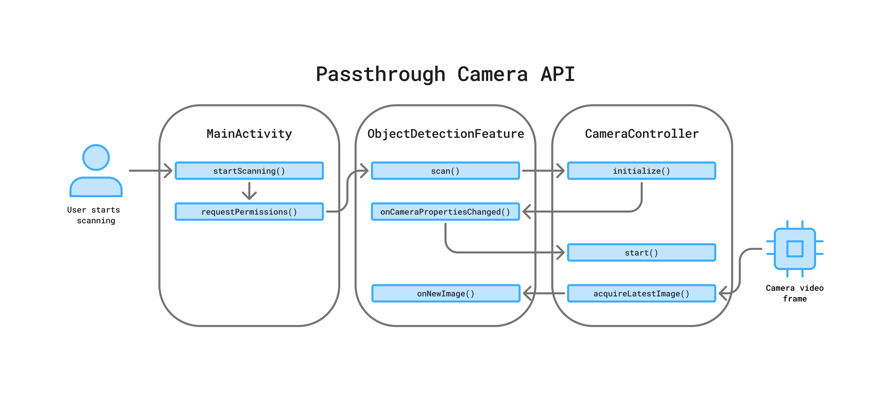
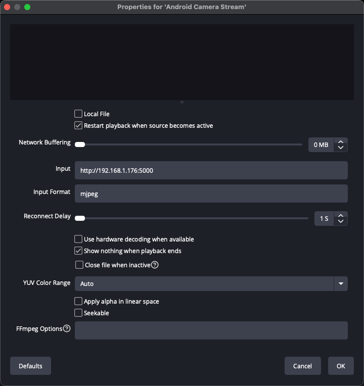

# Passthrough Camera API

This app utilizes the Meta Quest front-facing cameras, accessed through the Spatial SDK [Passthrough Camera API](https://developers.meta.com/horizon/documentation/spatial-sdk/spatial-sdk-pca-overview), as a core part of the app code architecture. A wrapper class called `CameraController` has been created for this access, which, along with its dependencies, can be easily adopted into other applications.

```
objectdetection/camera/enums/CameraEye.kt
objectdetection/camera/models/CameraProperties.kt
objectdetection/camera/CameraController.kt
```

# Table of Contents

- [Passthrough Camera API](#passthrough-camera-api)
- [Table of Contents](#table-of-contents)
- [Using CameraController](#using-cameracontroller)
  - [Prerequisites](#prerequisites)
  - [Requesting Permission](#requesting-permission)
  - [Order of Operations](#order-of-operations)
- [Use Cases](#use-cases)
  - [Video Frame Capture](#video-frame-capture)
    - [Live Streaming](#live-streaming)
    - [CV and AI Inference](#cv-and-ai-inference)
  - [Camera Preview](#camera-preview)
- [Opportunities for Growth](#opportunities-for-growth)


# Using CameraController

## Prerequisites

Make sure to read the official documentation linked above before integrating into your app. Particularly, at the time this document was written, the following prerequisites must be met in order to use the API on your Quest device:

1. Horizon OS v74 or later
2. Quest 3 or Quest 3S
3. A new permission for headset cameras will be required: `horizonos.permission.HEADSET_CAMERA`
4. **Passthrough feature**: must be **enabled** to access the Passthrough Camera API.

## Requesting Permission

Because the `CameraController` class was purposefully engineered as a standalone service, you must handle requesting permission for camera access in your Activity or Fragment **before** initializing or starting a camera session – otherwise, an Exception will be thrown. For an example of how this is done, look at the implementation in `LiveStreamingActivity` or `MainActivity`, which both use a callback pattern.

```kotlin
if (!hasPermissions()) {
    requestPermissions { granted ->
        if (granted) {
            // start using CameraController
        } else {
            // handle user denied permissions
        }
    }

    return
}

// start using CameraController
```

Also note the addition of the following to the app `AndroidManifest.xml`.

```xml
<!-- Tell the system this app requires camera access -->
<uses-feature android:name="horizonos.feature.HEADSET_CAMERA" android:required="true" />
<uses-permission android:name="horizonos.permission.HEADSET_CAMERA" />
```

## Order of Operations

In both cases, a specific order of operations was followed in order to use and dispose of the `CameraController` properly, as illustrated by the [Object Detection Code Architecture diagram](media/diagram-0-object-detection-code-architecture.png).

1. `constructor(context, cameraEye)` – pass a reference to the owning context, and (optionally) specify which camera to use (left or right)
2. `initialize()` – starts background threads, gets the system camera service, queries and saves camera properties
3. `start(surfaceProviders, imageAvailableListener)` – starts the camera session, displaying the camera feed on any provided `ISurfaceProviders` passed to the function, and invoking the `onNewImage` function on the `imageAvailableListener` passed to the function
4. `stop()` – closes the camera session; should be called whenever the camera feed isn't needed or visible anymore to conserve device energy usage
5. `dispose()` – closes the camera session and then shuts down the background threads; should be called when the app is shutting down or owning activity is being destroyed



> Note that both the `surfaceProviders` and `imageAvailableListener` parameters of the `start()` function are optional (`surfaceProviders` is optional in that an empty list is its default value). Based on what value(s) are passed to `start()`, this class can be used to display the camera feed on a Spatial Panel (via Jetpack Compose or traditional Android Views), for processing individual image frames, or both at once.

# Use Cases

The `CameraController` is used by this app in two places to demonstrate its usage as either a companion system in `LiveStreamingActivity`, or as an integrated part of the object detection capability in `ObjectDetectionFeature`.

## Video Frame Capture

By passing an object which implements the `ImageAvailableListener` pattern as the `imageAvailableListener` parameter of the `start()` function call, the owning object can receive individual video frames as they are ready, and process or utilize them in some manner.

```kotlin
fun onNewImage(image: Image, width: Int, height: Int, finally: () -> Unit)
```

> Note that the `finally` callback must be invoked before any more image frames are passed to the `imageAvailableListener`.

### Live Streaming

In `LiveStreamingActivity`, the camera frames are written to an output stream of an embedded server for consumption by other devices on the local network for further usage or streaming. In the example pictured below, [OBS Studio](https://obsproject.com/) is receiving the camera feed, which could then be broadcasted to a multitude of other platforms or services.


This streaming functionality was built as a proof-of-concept, and can be run on-device by moving the `<intent-filter>` in the `AndroidManifest.xml` from the `MainActivity` `<activity>` node to within the `LiveStreamingActivity` node below it.

```xml
<activity
    android:name="com.meta.pixelandtexel.scanner.activities.MainActivity"
    android:configChanges="screenSize|screenLayout|orientation|keyboardHidden|keyboard|navigation|uiMode"
    android:excludeFromRecents="false"
    android:exported="true"
    android:launchMode="singleTask"
    android:screenOrientation="landscape">
    <!-- REMOVED FROM HERE -->
</activity>

<activity
    android:name="com.meta.pixelandtexel.scanner.activities.LiveStreamingActivity"
    android:configChanges="screenSize|screenLayout|orientation|keyboardHidden|keyboard|navigation|uiMode"
    android:excludeFromRecents="false"
    android:exported="true"
    android:launchMode="singleTask"
    android:screenOrientation="landscape">
    <!-- ADDED HERE -->
    <intent-filter>
        <action android:name="android.intent.action.MAIN" />
        <category android:name="com.oculus.intent.category.VR" />
        <category android:name="android.intent.category.LAUNCHER" />
    </intent-filter>
</activity>
```

The embedded server functionality is located in `services/http/VideoServer.kt`, and can be configured to run at a specific port number at the device's IP address (defaults to 5000). In OBS, VLC, or any other software that can consume a remote video stream, configure your remote video source to use your Quest device's IP address (displayed on the Spatial Panel) and port number.



> **Note** that this live-streaming implementation uses a `mjpeg` stream, and is meant to be a starting point for others interested in adding live streaming to their application. For production code, consider using a h.264 MediaCodec surface, and potentially the real-time streaming protocol (RTSP) service, depending on your use case.

### CV and AI Inference

In `ObjectDetectionFeature`, camera frames are sent to `MLKitObjectDetector` for object detection inference. More on that can be read in the [ML Kit Object Tracking](MLKitObjectTracking.md) document.

## Camera Preview

Another way to use the `CameraController` class is by passing a list of `ISurfaceProvider` instances to the `start()` function. An Android `Surface` is a raw image buffer that is handed to the `CameraDevice` to draw into (see `CameraController::startInternal` for an example). The `ISurfaceProvider` interface was created as a simple contract for a structure which possesses a `Surface`, but whose surface may not be ready immediately. The `CameraController` will wait a short period for all surfaces to become ready, and will throw an exception on timeout.

```kotlin
interface ISurfaceProvider {
    val surface : Surface?
    val surfaceAvailable : Boolean get() = surface != null
}
```

In this app, the `ISurfaceProvider` is used and passed to a `CameraController` instance in two places. The first is visible in the live streaming proof-of-concept gif above as a camera preview view during a mock video stream or conference call. See the following classes for how the SurfaceView was embedded into the Jetpack Compose panel UI.

```
viewmodels/LiveStreamingViewModel.kt
views/camera/LiveStreamingScreen.kt
views/camera/CameraPreviewView.kt
```

The second place a `ISurfaceProvider` is used and passed to a `CameraController` instance is in `ObjectDetectionFeature`, and is visible if you pass true for the `spawnCameraViewPanel` parameter when constructing the `ObjectDetectionFeature` in your Activity. Enabling this spawns a Spatial Panel which renders the camera feed and any detected objects, and is used for debugging object detection. More can be read about that in the [ML Kit Object Tracking](MLKitObjectTracking.md) document.


# Opportunities for Growth

In addition to the use cases listed above and implemented in this app, Quest camera access through the [Passthrough Camera API](https://developers.meta.com/horizon/documentation/spatial-sdk/spatial-sdk-pca-overview) could be used for a multitude of purposes, like capturing photos or videos, applying filters and effects, live streaming, educational experiences, and much more.

`CameraController` and its dependencies hopefully serve as a starting point for other developers intending to inegrate camera functionality into their applications, or at the least, a demonstration on how the Passthrough Camera API could be accessed and utilized for other purposes.
