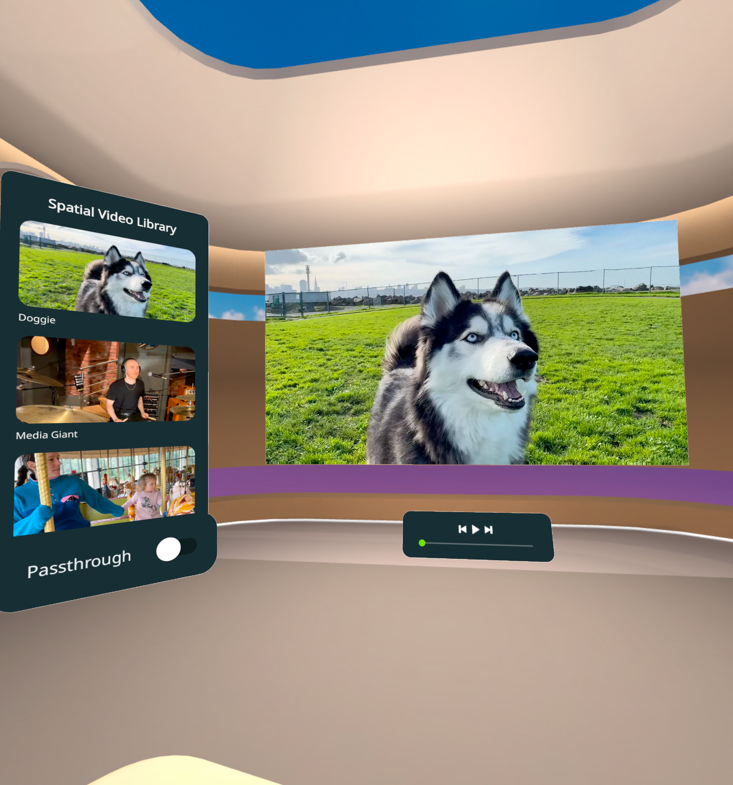

# Spatial Video sample

The Spatial Video Sample shows how to play spatial video (different video for left and right eye) with spatialized audio. Users can browse and select videos from a library panel, control playback, and toggle between VR and Passthrough (MR) modes. The video panel is grabbable and repositionable in MR mode.

## Highlighted features
The Spatial Video Sample uses the following Meta Spatial SDK features:
* [2D Panels](https://developers.meta.com/horizon/documentation/spatial-sdk/spatial-sdk-2dpanel): The sample uses Jetpack Compose based panels for the video library browser and playback controls.
* [Passthrough](https://developers.meta.com/horizon/documentation/spatial-sdk/spatial-sdk-passthrough/): The sample provides a toggle for the user to switch between the VR media room environment and Passthrough (MR) mode.
* [Grabbable](https://developers.meta.com/horizon/documentation/spatial-sdk/spatial-sdk-grabbable): In MR mode, the video panel can be grabbed and repositioned in the user's physical space.
* **Stereo Video**: The sample demonstrates stereo video playback using `StereoMode.LeftRight`, where a single 3840x1080 side-by-side video stream is split so each eye receives its own 1920x1080 view.
* **Custom Shaders**: The video panel uses custom 3D mesh rendering with reflection and shadow shaders for a premium visual experience.
