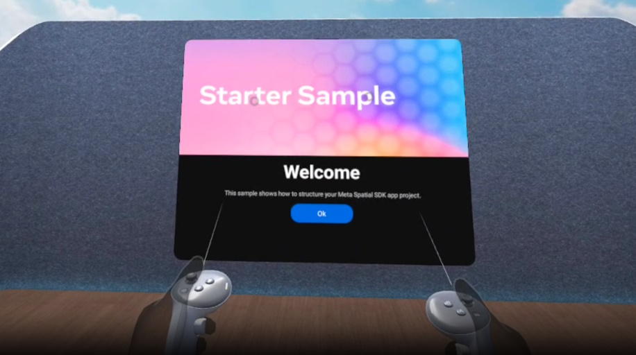

# Starter sample

The starter sample is a template project that is part of the [Getting started](https://developers.meta.com/horizon/documentation/spatial-sdk/spatial-sdk-helloworld) tutorial for Meta Spatial SDK.

## Highlighted features
The starter sample provides you with all the assets needed for the [Getting started](https://developers.meta.com/horizon/documentation/spatial-sdk/spatial-sdk-helloworld) tutorial for Meta Spatial SDK
